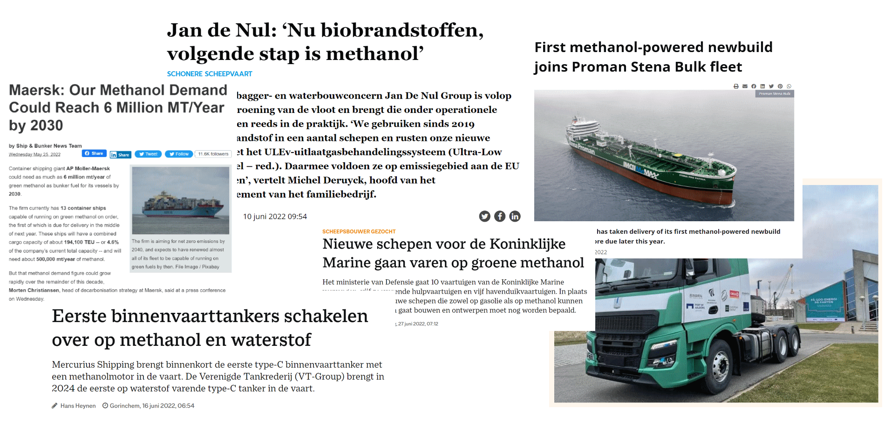

# Designing an e-fuel supply chain

 

Niels Wouda, Ward Romeijnders, Evrim Ursavas

08-03-2023

---

## Motivation

- Fossil fuel consumption emits lots of CO$_2$
- Not everything can switch to electricity:
  - Shipping
  - Aviation
  - Chemical/heavy industry
- Remains a need for **low-carbon** variants of kerosene, methanol
- These can be made from:
  - Biomass
  - Electricity (e-fuels)

Note:

Biomass is iffy, and probably not enough to cover entire industry.

----

## Motivation

- E-fuels have 'simple' chemistry:
    - **Electrolysis**: water + electricity $\longrightarrow$ hydrogen
    - **Carbon capture**: exhaust fumes + electricity $\longrightarrow$ carbon dioxide
    - **Hydrogenation**: hydrogen + carbon dioxide $\longrightarrow$ e-fuel
- **Low-carbon** when renewable electricity is used

Note:

"Low-carbon", not necessarily carbon-neutral, because it really depends on where you get your carbon from.
But it's basically a win either way.

----

## Motivation

- Making e-fuels is expensive
- In a big part due to renewable electricity costs
- But those are not as high anymore as they used to be

<small>

Adapted from Figure ES.3 of IRENA (2021), _Renewable Power Generation Costs in 2020_, International Renewable Energy Agency. https://irena.org/publications/2021/Jun/Renewable-Power-Costs-in-2020

</small>

---

## Supply chain

- How do we build a (cost-)efficient e-fuel supply chain?
  - And how do we deal with uncertain demand, electricity supply?
  - System perspective, not individual companies/operators.
- Big optimisation problem with many uncertain parameters
- Goal: build a supply chain that's not too expensive, but can meet demand in sufficiently many cases (service level guarantee).

---

## Methodology

Large optimisation problem:

- Minimise cost of construction decisions

- Many decisions need to be integral (hard!)

- Constructed supply chain needs to meet service level guarantee (hard!)

- Doing everything at the same time takes _a lot of time_ to find an optimal solution

**THIS IS HARD**

----

## Methodology

- Instead, start small: just guess an optimal solution.

- Then test if that guess meets the service level guarantee:

  - If yes: done.

  - If no: we learn something about how to improve our decisions!

- Optimise again with what we learned.

- Continue until done.

---

## Case studies

We are currently investigating two settings:

- Sustainable aviation fuel (SAF) production in several EU countries.
- Methanol production in the Netherlands.

Note:

The first, SAF part is based on the master thesis of a former student.
The second, methanol part is part of my paper.
Since the master thesis is good _and_ mostly done, I will spend most of my time on that.

----

### SAF production

- SAF from captured CO$_2$ via formic acid (FA) production
- Uncertain SAF demand in 2030; electricity from grid
- Two configurations:

----

### Results

Note:

2030 ambitions for SAF are not _that_ big, about 5% of current kerosene consumption.
That means you basically need to find one or two big emitters and refineries, and you can satisfy all local SAF demand.
As a consequence, you get a very scattered/separated supply chain.
Everything is very local, particularly in the UK where there are a lot of refineries.

----

### Results

Note:

This figure presents the minimum jet fuel selling price, that is, the minimum price you'd need to charge for the SAF not to go bankrupt.
Making SAF via direct air capture is more expensive, but not even that much more expensive.
One limitation is that the transport costs are not modeled in detail, and likely bigger than presented here.

----

### Results

Conversion efficiency matters *a lot*

----

### Methanol production

- Methanol from captured CO$_2$ and hydrogen
- Using renewable electricity from offshore wind: uncertainty in demand and supply.
- Offshore energy islands?

Note:

There's some debate about these energy islands, and they might be a good idea.
We want to investigate that a bit further.

----

### Results

- Energy islands make a lot of sense because transporting electricity offshore is really expensive.
- Separate wind parks: less dependency on wind.
- Cluster e-fuel near existing industry, in coastal regions.

Note:

I want to present some conclusions based on a representative solution.
No numbers here because I haven't 100% checked yet that it all makes sense :-).

Energy islands are particularly cost-effective when connecting wind parks relatively far offshore. 
Those wind parks are typically constructed when larger energy demands need to be met. 
In most of the scenarios we have so far solved, we observe that our model prefers a number of smaller energy islands, rather than a single central hub. 

Second, the solution of Figure 1 shows that our model prefers to build wind parks relatively far apart, and connect these wind parks to multiple facilities, resulting in an overall rather connected network. 
These two properties follow from the stochasticity in wind speeds: our model aims to minimise spatial dependencies due to exposure to the same wind, which improves the resilience of the resulting network, and thus the service level that can be guaranteed. 
The ability to exploit this stochastic information is another clear argument in favour of modelling approaches that take supply uncertainty into account explicitly.

Third, the solution of Figure 1 shows that it is cost-effective to cluster carbon capture and e-fuel installations in coastal regions, near existing industry.
In particular, the industrial areas around IJmuiden, the port of Rotterdam, and Vlissingen appear prime candidates for e-fuel production plants. 
Together, these three plants could produce over five megatons of methanol annually, at a cost a few times higher than current (fossil-based) market prices.

---

## Conclusion

- E-fuels are not that far from cost-competitive if done 'all at once', from a system perspective.
- But policy and regulation would help, particularly when we want to get individual operators to agree to work together on this.
