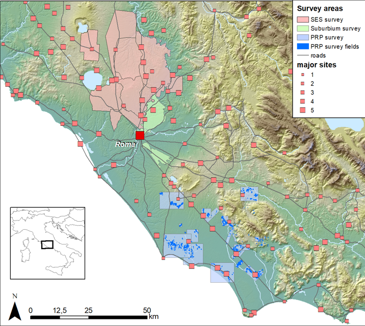
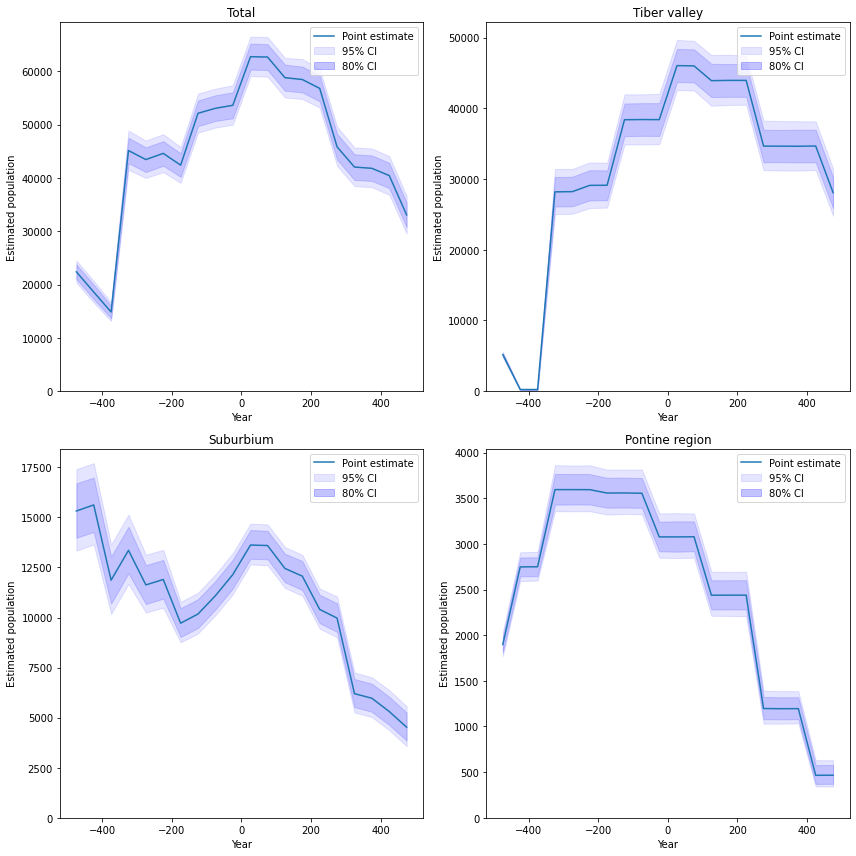
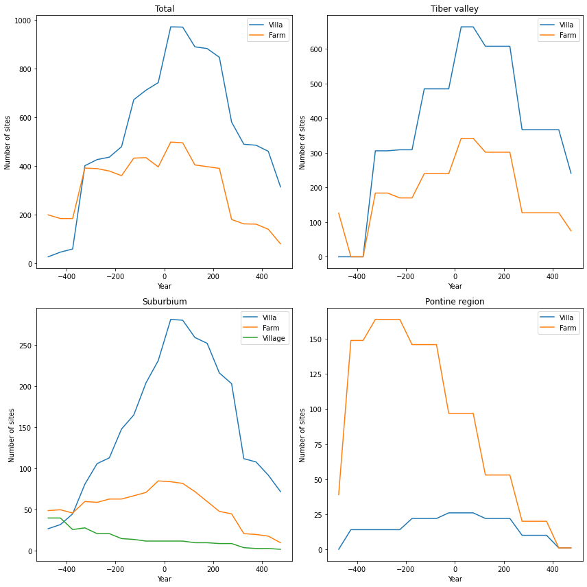
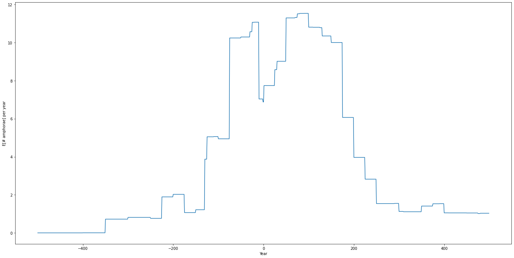
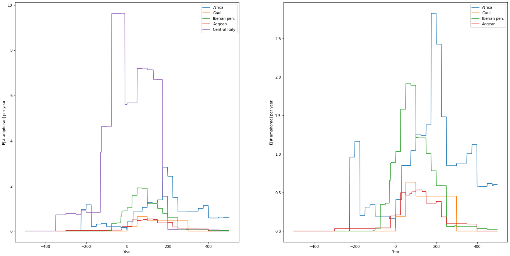
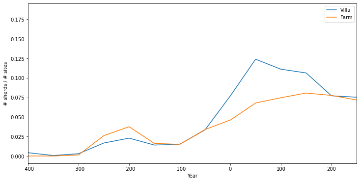

# ECONOMETRICS, ARCHAEOLOGICAL 'BIG DATA' AND THE ROMAN ECONOMY

Niels A. Wouda, Faculty of Economics and Business

Willem M. Jongman, Department of History

 

27-08-2020

---

# The Rome Hinterland Project

- Tiber Valley project/South Etruria survey, _British School at Rome_
- Suburbium survey, _Sapienza University of Rome_
- Pontine Region project, _University of Groningen_

---

## Trends in population

---

## Trends in site numbers

---

## Trends in dated amphorae

---

## Trends in provenance

---

## Trends in market access

---

# Conclusions

### Methodological

- Integrating multiple survey datasets is very worthwhile, and the more the 
  better
- High quality modern datasets are preferable

### Historical
- Major population growth from 300 BC until about AD 200, and decline thereafter
- Per capita consumption was also significantly higher, and not just among the elite
- Demand was first met locally, but increasingly from the wider Mediterranean 

---

# The Rome Hinterland Project

[http://comparativesurveyarchaeology.org/](http://comparativesurveyarchaeology.org/)

| | |
| --- | --- |
| Peter Attema| Martijn van Leusen |
| Remco Bronkhorst | Christopher Smith |
| Maria Cristina Capanna | Gijs Tol |
| Paolo Carafa | Rob Witcher |
| Tymon de Haas | Niels Wouda |
| Willem Jongman | |

 

<small>
    We thank Maria Cristina Capanna, Tymon de Haas, and Gijs Tol for their feedback
    on an earlier version of our analysis.
</small>
