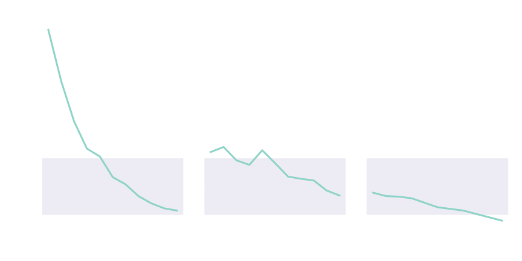

# Syngas from carbon dioxide and renewable electricity

 

Niels A. Wouda

01-12-2021

Note:

syngas = synthetic gas, as opposed to natural gas

---

## Motivation

- In NL, about 45% of total energy consumption is based on natural gas [3]
- Gas emits carbon dioxide when burned
- Syngas has 'simple' chemistry:
    - **Electrolysis**: water + electricity $\longrightarrow$ hydrogen (+ oxygen)
    - **Methanation**: hydrogen + carbon dioxide + electricity $\longrightarrow$ syngas (+ water)
- When syngas is burned, carbon dioxide can be captured to make new syngas
  - Completely **carbon-neutral** when renewable electricity is also used

Note:

I am mostly interested in the future of our energy system.
Today's energy system used a lot of natural gas - in NL, and many other countries as well.
It would be nice if we can provide a carbon-neutral alternative method to create such gas, so we do not have to retool half the world's energy infrastructure.
Syngas production from captured carbon dioxide and renewable electricity is such a carbon-neutral alternative.

----

## Motivation

- Electrolysis, methanation and carbon capture are very expensive
- But, so were (offshore) wind and solar just a decade ago: [1]

<!---  --->

    (Electrolysis has similarly gone down in cost by ~40% in past five years [2])

Note:

A lot less is known about methanation and carbon capture, I am afraid.
Those technologies are still quite new, and I could not really find reviews on their costs.
Undoubtedly those will also show up in the coming few years.
Based on the other figures, I am fairly confident they will also show cost reductions.

----

## Motivation

- Syngas today is more expensive than natural gas
  - But how much more expensive?
  - What drives costs?
- What carbon tax would make syngas production cost-competitive?

---

## Solution approach

- If we can design a syngas production network at minimal cost, we:
  - have an estimate of the cost of syngas production;
  - know the relative costs of all parts of the network;
  - can determine a carbon tax that makes syngas production cost-competitive.
- This network design problem has many **policy implications**!

So, what I work on is this:
> How to construct a minimum-cost network for syngas production using captured carbon dioxide and renewable electricity?

---

## Conclusion

- Syngas is great in theory, but expensive in practice
- I want to find out what drives the cost of syngas production
- What is needed to make syngas cost-competitive?

Note:

What about oxygen and/or water 'waste' products? Recall the chemistry bit.

---

## References

1. Adapted from Figure ES.3 of 
   IRENA (2021), _Renewable Power Generation Costs in 2020_, 
   International Renewable Energy Agency.

2. Glenk, G., Reichelstein, S. 
   Economics of converting renewable power to hydrogen.
   _Nature Energy_ 4, 216–222 (2019). https://doi.org/10.1038/s41560-019-0326-1

3. CBS (2020), _Energiebalans; aanbod, omzetting en verbruik_, 
   https://www.cbs.nl/nl-nl/cijfers/detail/83140NED.
