# Solving a static and dynamic VRP with time windows

 

**OptiML**

Jasper van Doorn, Leon Lan, Luuk Pentinga, Niels Wouda

7 December 2022

---

# Static solver

High-level overview:

- Simplify given baseline
- Tweak local search
- (and more that we do not have time for)

Note:

The first two are what I want to explain in more detail today.
Since we do not have a lot of time, I will not go into what we did for diversity management, or how we tuned the many parameters of our static solver.
That is also very interesting (and turned out to be really important, too!), so if you want to know more, we refer to both the codebase and the four-page summary paper on our methods.

----

## Simplify baseline

- First, we refactored the entire codebase, and added Python bindings.
- Then, we removed:
  - constructive heuristics
  - circle sectors
  - giant tour representation and split algorithm
  - dynamic growth of granular neighbourhoods and minimum population size

> Our ``Config`` object has 26 fields, compared to the baseline's 42.

Note:

Constructive heuristics could be removed because we wanted to get into the main genetic search loop as quickly as possible.
Our initial population is randomly generated.
We removed the circle sectors because we do intensification somewhat differently (more on that in the next slide).
The giant tour representation and the linear split algorithm were only needed for the ordered exchange crossover.
We remove that crossover, which meant we no longer needed to store the giant tour.
The dynamic growth parameters did not seem to help much because the sizes they control are already 'large enough'. 

Removing all this did not seem to hurt performance at all.
So we more or less made everything much simpler at zero cost to performance.

Having many fewer parameters was a big boon when it came to tuning.

----

## Tweak local search

<!-- .slide: data-transition="none" -->

Baseline:

- <b>Always at least two iterations. Later iterations test against empty routes.</b>

Ours:

- <b>One iteration if no improvement. Empty routes rarely result in improvement.</b>

Note:

The baseline local search loop performs at least two iterations.
We found that this was very rarely useful if the first iteration does not yet result in an improvement.
So we removed the two iterations requirement, and do multiple iterations only if there has been an improvement.

----

## Tweak local search

<!-- .slide: data-transition="none" -->

Baseline:

- Always at least two iterations. Later iterations test against empty routes.
- <b>Probabilistically apply intensification with RELOCATE* and SWAP*.</b>
- <b>Uses circle sector restriction for intensification.</b>

Ours:

- One iteration if no improvement. Empty routes rarely result in improvement.
- <b>Apply intensification only for new best individuals.</b>
- <b>Since new best individuals are rare, no circle sector restriction is needed.</b>

Note:

We moved intensification with route operators out of the regular local search loop.
It is a separate function now, that is only called when we find a new best individual.

As a consequence, we no longer needed the circle sector restriction.

----

## Tweak local search

<!-- .slide: data-transition="none" -->

Baseline:

- Always at least two iterations. Later iterations test against empty routes.
- Probabilistically apply intensification with RELOCATE* and SWAP*.
- Uses circle sector restriction for intensification.
- <b>Hard-coded operators.</b>

Ours:

- One iteration if no improvement. Empty routes rarely result in improvement.
- Apply intensification only for new best individuals.
- Since new best individuals are rare, no circle sector restriction is needed.
- <b>Modular operator set.</b>
- <b>Templated $(N, M)$ exchange with many small performance tweaks.</b>

Note:

Our operators are stored as lists of function pointers.
We run through these and apply the operators.
So not running an operator is as easy as not providing it to the local search in the first place.

$(N, M)$ exchange covers six out of eight node-based operators.
So having one bit of code for all that means we can very effectively improve a lot of operators at the same time.

---

# Dynamic solver

Idea:
> Simulate ahead to determine which requests to postpone

Note:

This is easiest to explain via an example, which we will go through in the next few slides.

----

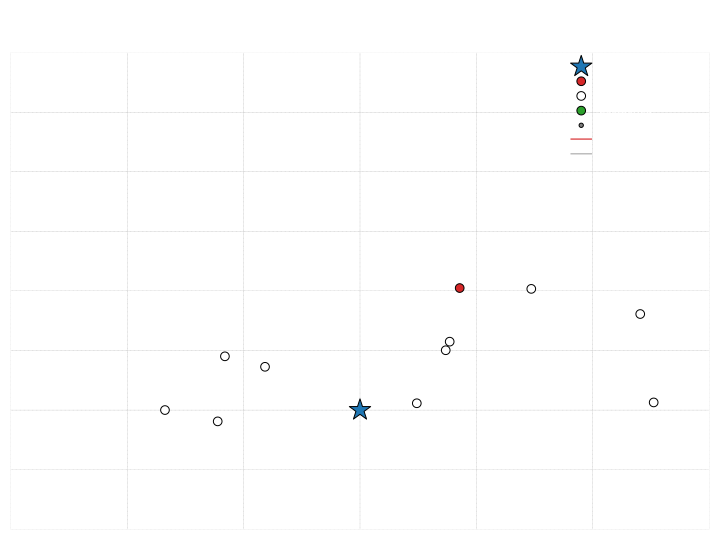

Note:

Every epoch, we have a set of 'must-dispatch' and 'optionally dispatch' requests.
Some optional requests we want to dispatch along with the must-dispatch requests, since that might result in fairly efficient routes.

Here you see an example epoch with one 'must-dispatch' request, and ten optional requests.

----

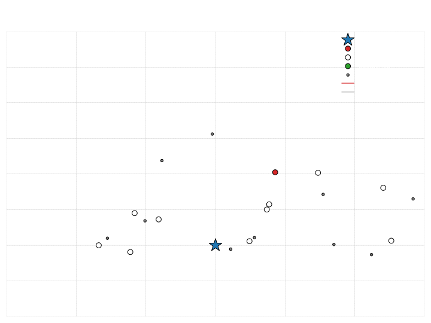

Note:

Our dynamic solution simulates ahead, drawing samples for future epochs.
This slide shows the simulation instance.
The simulation instance is the epoch instance, together with a set of sampled future requests. 
The sampled future requests have smaller node sizes and grey color, to distinguish from the epoch requests.

----

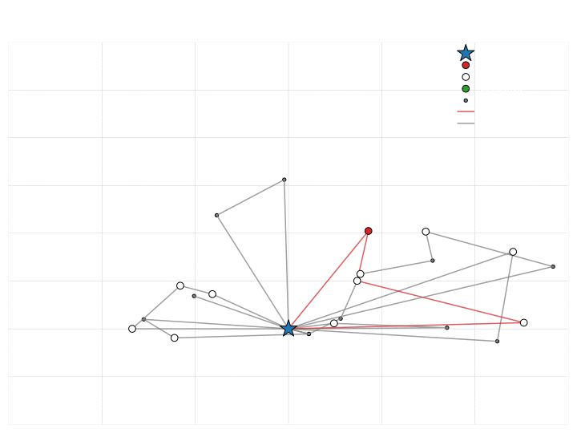

Note:

We solve each simulated instance very quickly, in less than half a second.
This slide shows the simulation solution, i.e., the solution that is obtained by solving the simulation instance.
Routes that do not contain the must-dispatch request are coloured grey.
The route that contains the must-dispatch request is colored red.

Of course, this is just one simulation.
We do this many more times.

----

<!-- 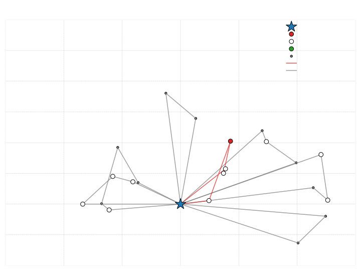 -->
<!-- 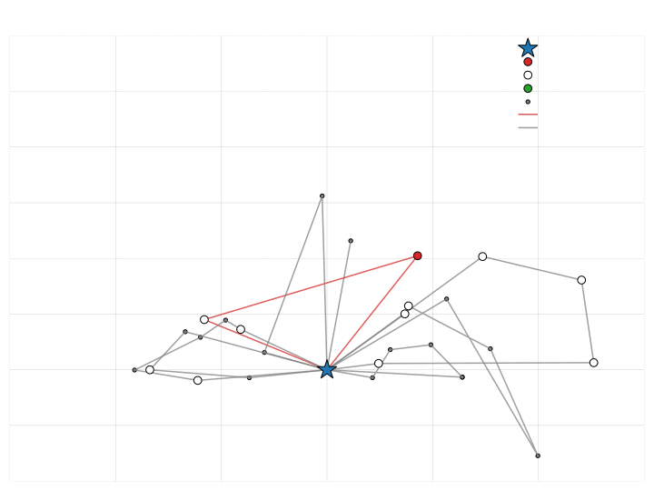 -->
<!-- 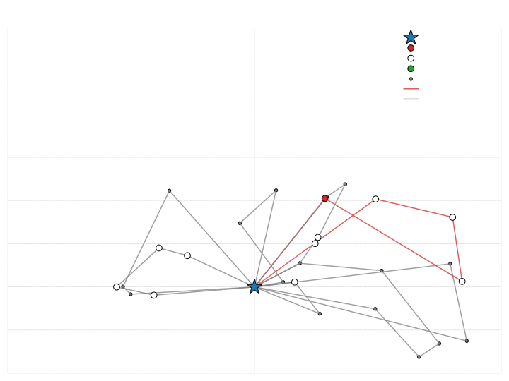 -->
<!-- 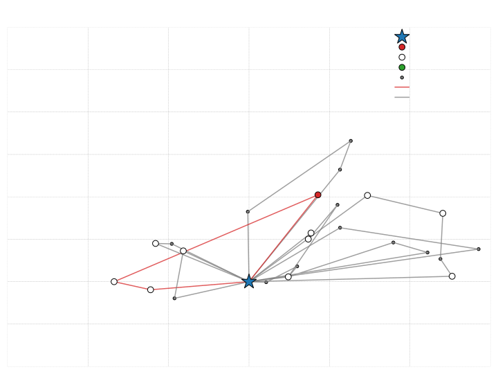 -->
<!-- 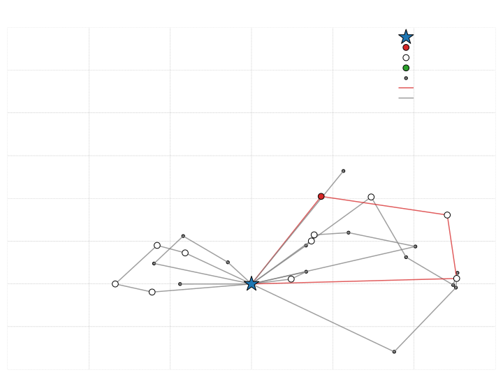 -->
<!-- 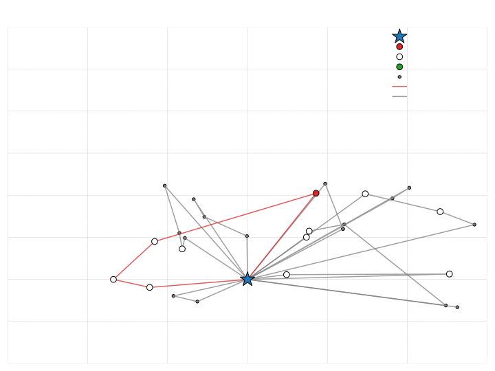 -->

<svg width="80%" height="100%" viewBox="0 0 720 540" xmlns="http://www.w3.org/2000/svg" xmlns:xlink="http://www.w3.org/1999/xlink">
  <image width="100%" height="100%" xlink:href="images/cycle0/simulation_instance_with_solution_2_0_4.jpg">
    <animate attributeName="xlink:href" 
      values="images/cycle0/simulation_instance_with_solution_2_0_4.svg;images/cycle0/simulation_instance_with_solution_2_0_6.svg;images/cycle0/simulation_instance_with_solution_2_0_7.svg;images/cycle0/simulation_instance_with_solution_2_0_9.svg;images/cycle0/simulation_instance_with_solution_2_0_11.svg;images/cycle0/simulation_instance_with_solution_2_0_12.svg;" 
      begin="0s" repeatCount="indefinite" dur="6s"/>
  </image>
</svg>

Note:

We solve on average 40-50 simulation instances.
On this slide, you can see a few of the solutions: observe that the must-dispatch request shares routes with a number of different optional requests.
This gives us distributional information on how often optional requests are part of 'must-dispatch routes', that is, how often those optional requests are paired with must-dispatch requests.

----

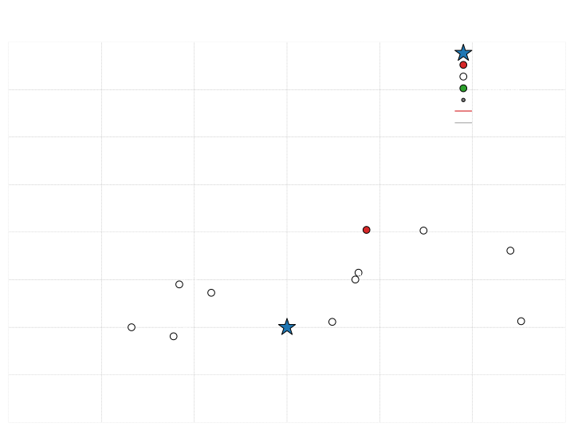

Note:

We use that distributional information to decide which optional requests to postpone to later epochs.
This works in a very simple way: if an optional request is not dispatched often with a must-dispatch request, we postpone it.
We use a simple threshold to determine this, in this case 80% for postponement.

In the competition we used different thresholds for different epochs.

----

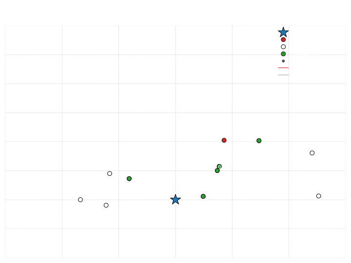

Note:

This slide is the same as the previous one, but now the postponed optional requests are marked.
What we noticed doing this is that often we did not postpone enough requests for later epochs.
We solve that by applying another cycle of simulations, where we use release dates to prevent the postponed requests from being paired with the must-dispatch request.

----

<!-- 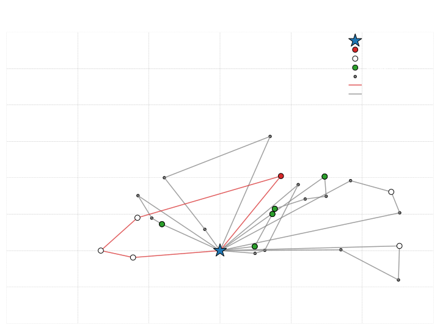 -->
<!-- 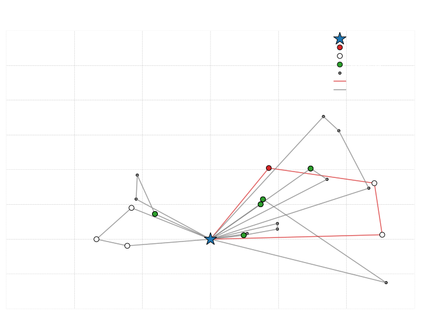 -->
<!-- 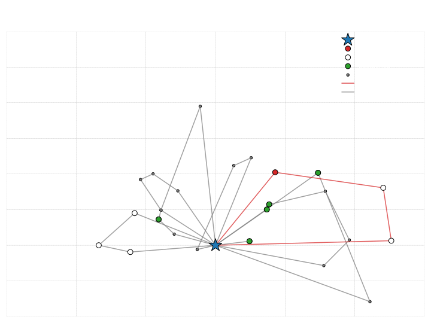 -->
<!-- 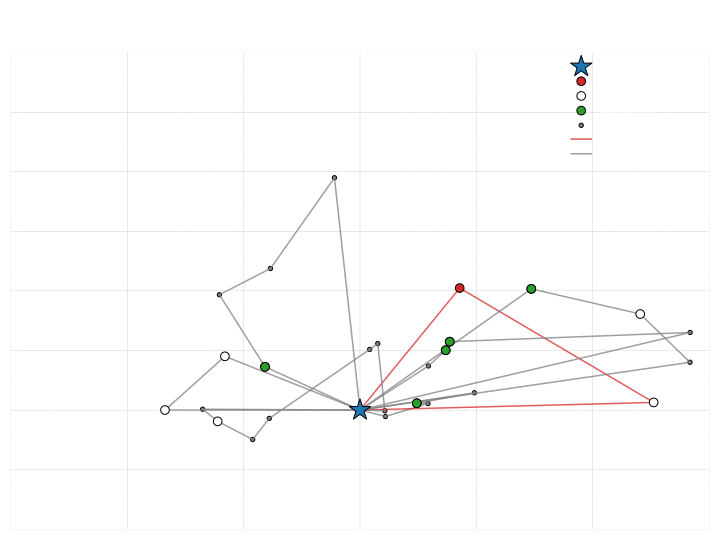 -->
<!-- 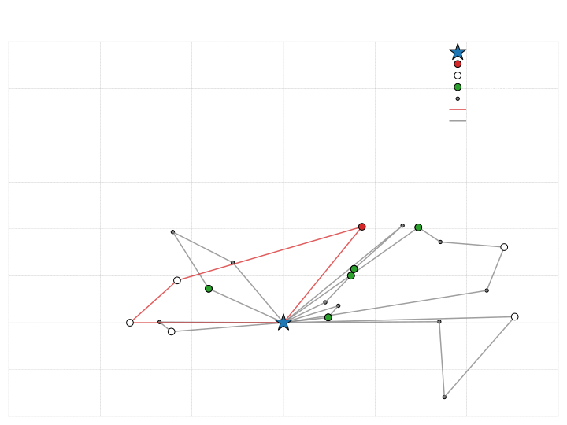 -->
<!-- 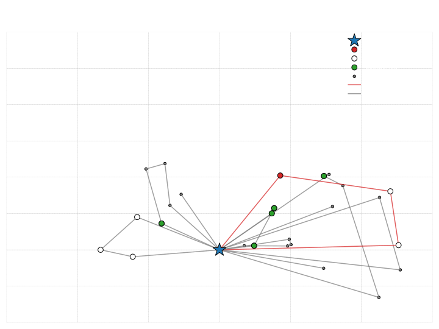 -->

<svg width="80%" height="100%" viewBox="0 0 720 540" xmlns="http://www.w3.org/2000/svg" xmlns:xlink="http://www.w3.org/1999/xlink">
  <image width="100%" height="100%" xlink:href="images/cycle1/simulation_instance_with_solution_2_1_1.jpg">
    <animate attributeName="xlink:href" 
      values="images/cycle1/simulation_instance_with_solution_2_1_1.svg;images/cycle1/simulation_instance_with_solution_2_1_2.svg;images/cycle1/simulation_instance_with_solution_2_1_4.svg;images/cycle1/simulation_instance_with_solution_2_1_6.svg;images/cycle1/simulation_instance_with_solution_2_1_7.svg;images/cycle1/simulation_instance_with_solution_2_1_8.svg;" 
      begin="0s" repeatCount="indefinite" dur="6s"/>
  </image>
</svg>

Note:

This slide shows another cycle of simulations.
In the competition we performed three such cycles.

----

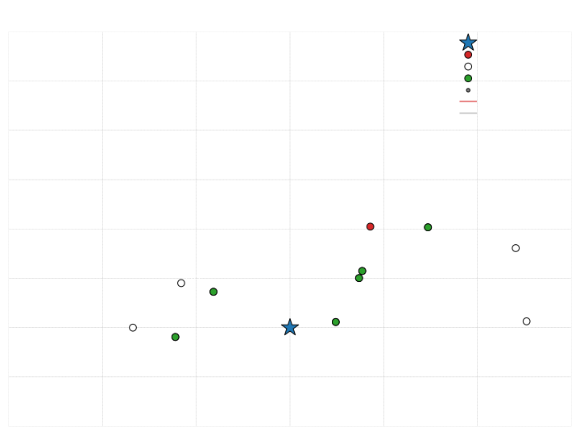

Note:

After the cycle of simulations we postpone another optional request.

----

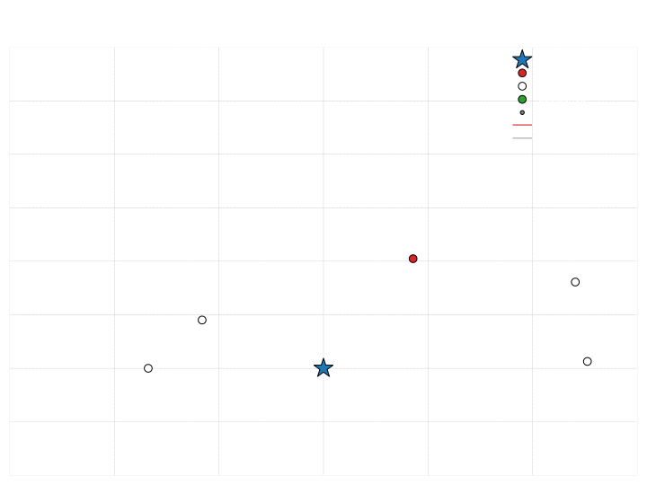

Note:

After parameter tuning, we decided on doing three such simulation cycles.
This slide shows the final dispatch instance, which is obtained after the last simulation cycle.

----

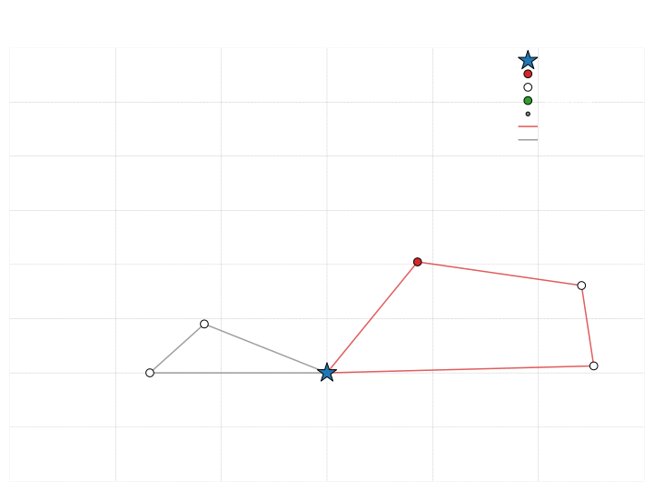

Note:

When we have obtained the requests we dispatch in the current epoch, we again call the static solver.
This slide shows the obtained dispatch solution. 

----

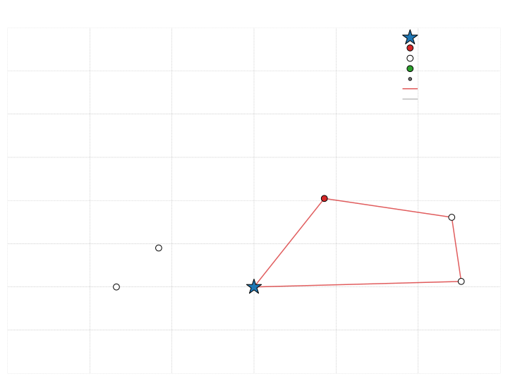

Note:

With the dispatch solution in hand, we apply one last trick: we filter away any route that does not contain a must-dispatch request.
Such routes only contain optional requests, and those requests could, for example, be paired with new requests in later epochs.

What you see on this slide is the solution we return to the environment.

And that is more or less it!

---

# Thank you

Questions? n.a.wouda@rug.nl

Code: https://github.com/N-Wouda/Euro-NeurIPS-2022

Note:

We do not have any time for questions right now, but please feel free to e-mail me.
The code is available in the linked repository.
