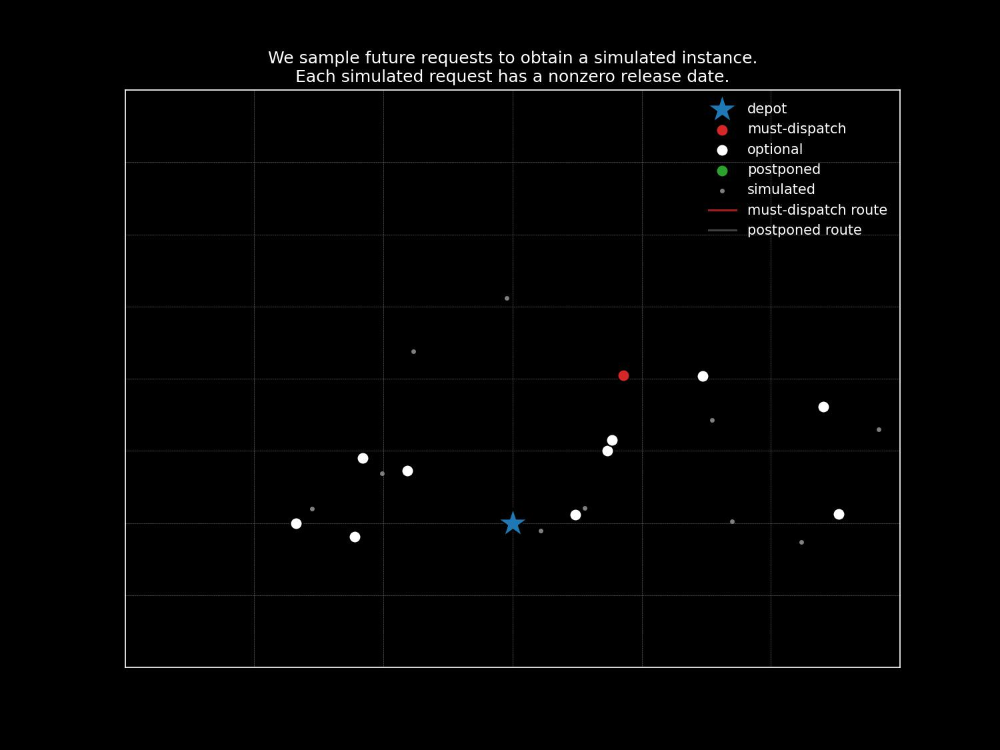
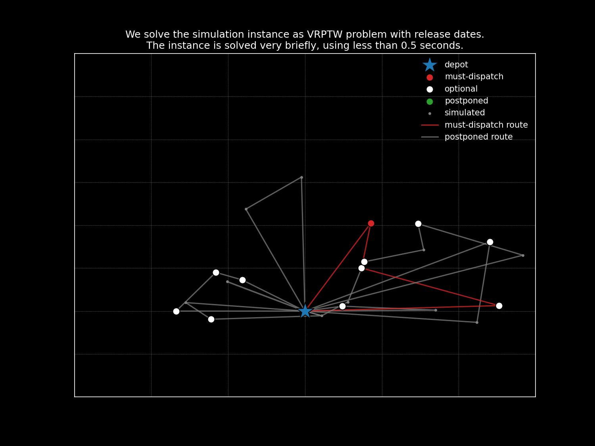
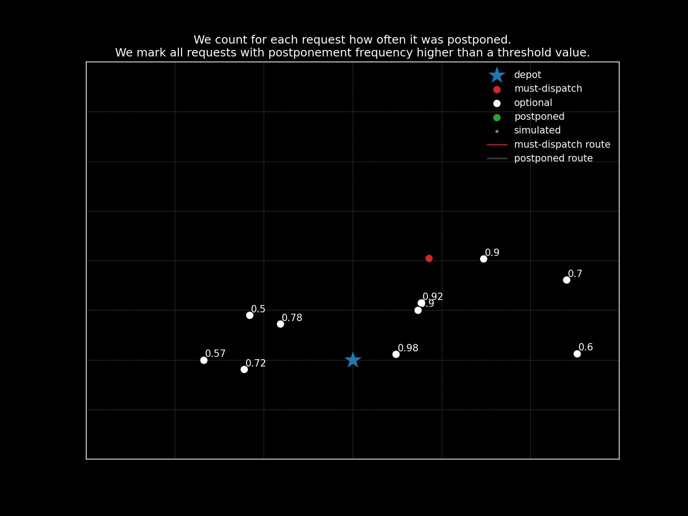
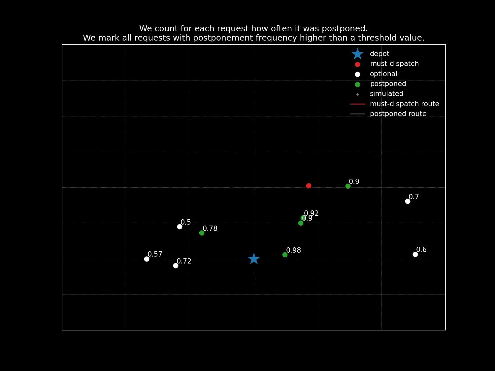
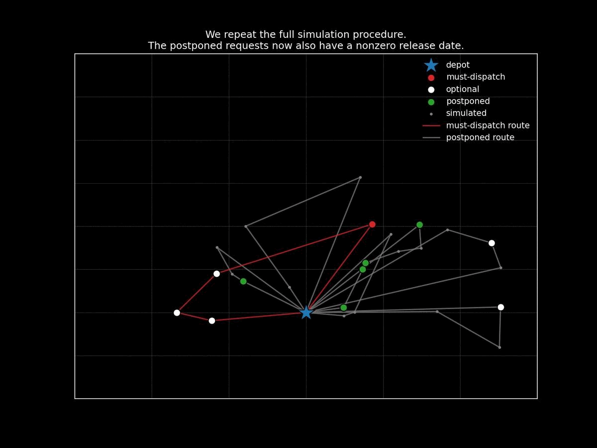
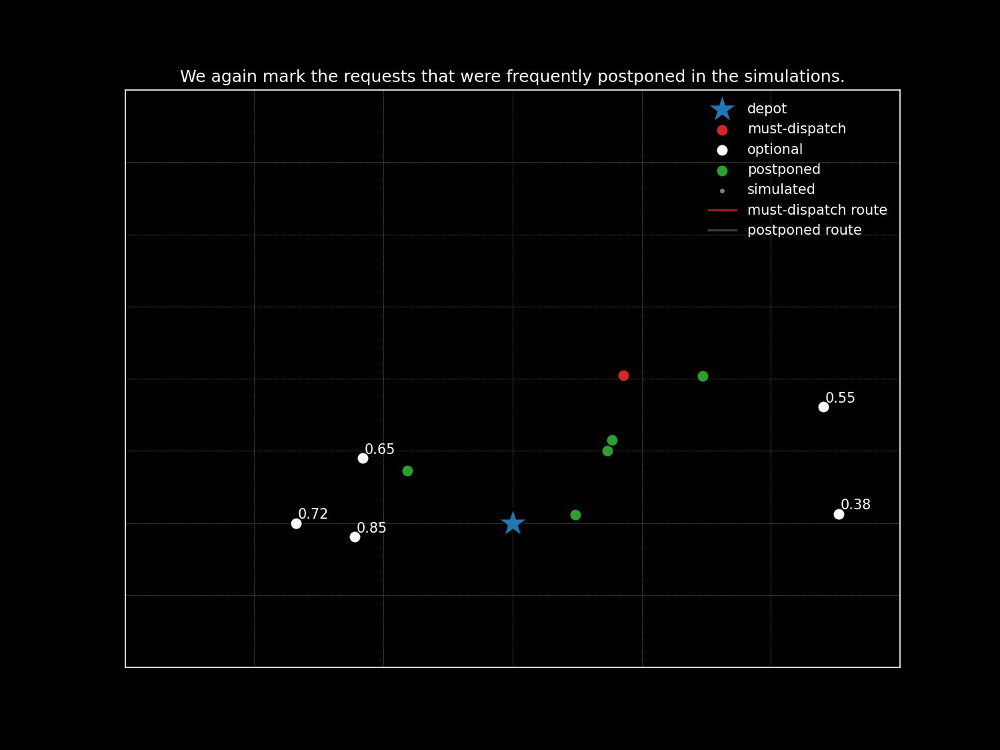
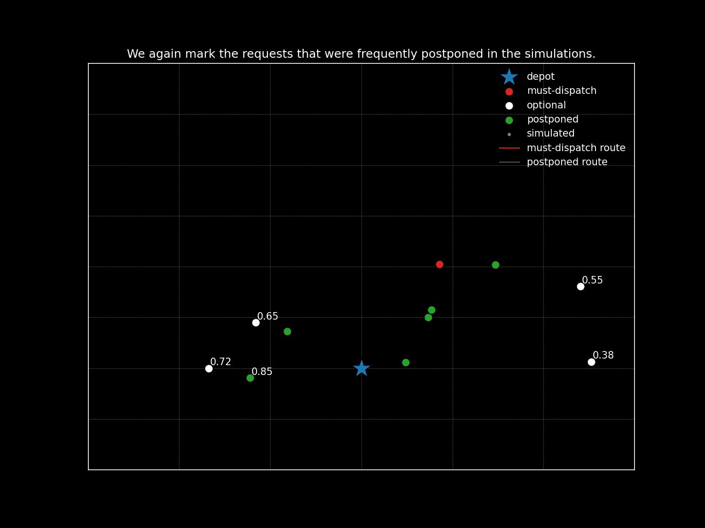
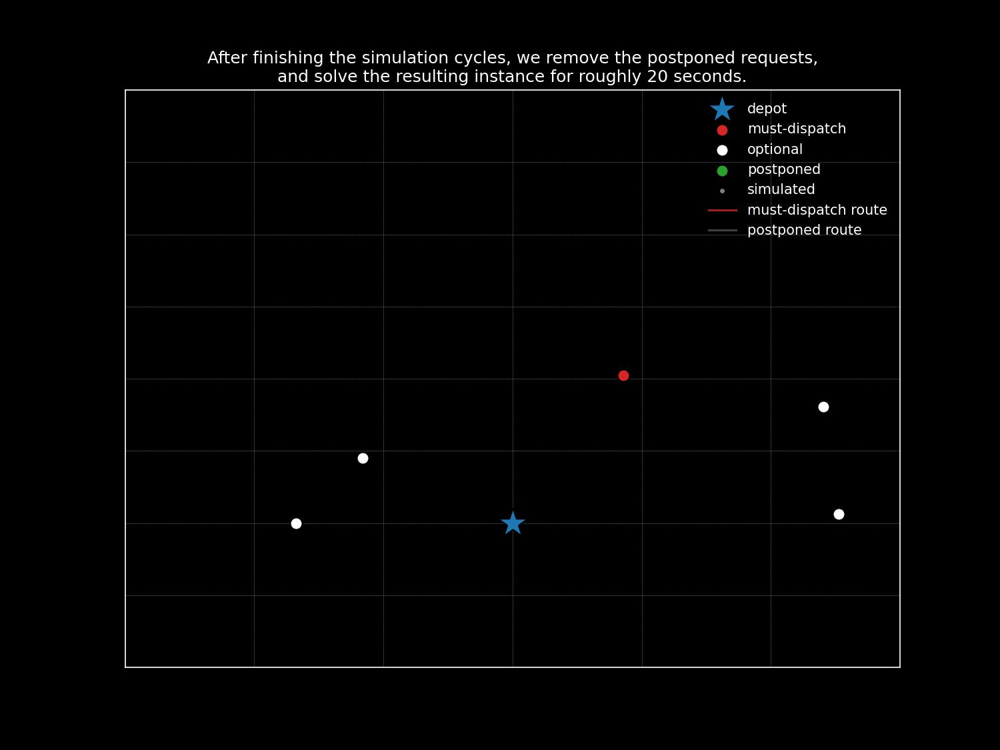
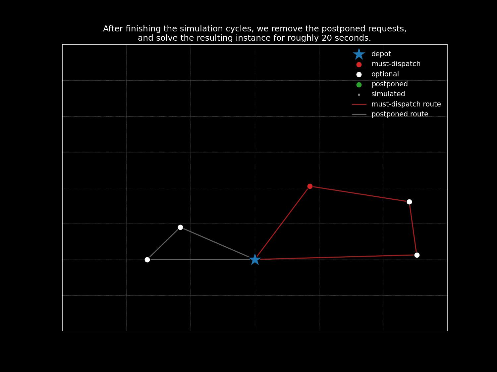
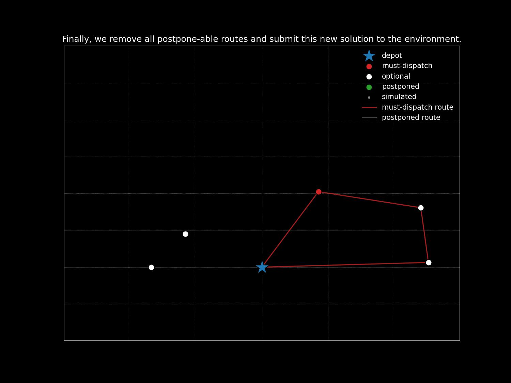

# Solving a static and dynamic VRP with time windows

 

**OptiML**

Jasper van Doorn, Leon Lan, Luuk Pentinga, Niels Wouda

7 December 2022

---

# Static solver

----

## High-level overview

- Simplify given baseline
- Tweak local search

Note:

The first two are what I want to explain in more detail today.
Since we do not have a lot of time, I will not go into what we did for diversity management, or how we tuned the many parameters of our static solver.
That is also very interesting (and turned out to be really important, too!), so if you want to know more, we refer to both the codebase and the four-page summary paper on our methods.

----

## Simplify baseline

- First, we refactored the entire codebase, and added Python bindings.
- Then, we removed:
  - constructive heuristics
  - circle sectors
  - giant tour representation and split algorithm
  - dynamic growth of granular neighbourhoods and minimum population size

> Our ``Config`` object has 26 fields, compared to the baseline's 42.

Note:

Constructive heuristics could be removed because we wanted to get into the main genetic search loop as quickly as possible.
Our initial population is randomly generated.
We removed the circle sectors because we do intensification somewhat differently (more on that in the next slide).
The giant tour representation and the linear split algorithm were only needed for the ordered exchange crossover.
We remove that crossover, which meant we no longer needed to store the giant tour.
The dynamic growth parameters did not seem to help much because the sizes they control are already 'large enough'. 

Removing all this did not seem to hurt performance at all.
So we more or less made everything much simpler at zero cost to performance.

Having many fewer parameters was a big boon when it came to tuning.

----

## Tweak local search

Baseline:

- Always at least two iterations. Later iterations tests against empty routes.
- Probabilistically apply intensification with RELOCATE* and SWAP*.
- Uses circle sector restriction for intensification.
- Hard-coded operators.

Ours:

- One iteration if no improvement. Empty routes very rarely result in improvement.
- Apply intensification only for new best individuals. 
- Since new best individuals are fairly rare, no circle sector restriction is needed.
- Modular operator set.
- Templated $(N, M)$ exchange with many small performance tweaks.

Note:

Our operators are stored as lists of function pointers.
We run through these and apply the operators.
So not running an operator is as easy as not providing it to the local search in the first place.

$(N, M)$ exchange covers six out of eight node-based operators.
So having one bit of code for all that means we can very effectively improve a lot of operators at the same time.

---

# Dynamic solver

----

## High-level overview
Simulate future epochs to determine which requests to postpone

----
<!---
This slide shows the epoch instance, that is, all requests available at the
start of an epoch. The requests are color-coded: red for must-dispatch requests
and yellow for optional requests. The depot a big blue star. 
-->

----
<!---
This slide shows the simulation instance. The simulation instance is the epoch
instance, together with a set of sampled future requests. The sampled future
requests have smaller node sizes and grey color, to distinguish from the
epoch requests.
-->

----
<!--
This slide shows the simulation solution, i.e., the solution that is obtained
by solving the simulation instance. Each route starts and ends at the depot.
Routes that do not contain any must-dispatch requests are colored green/grey.
Routes that do contain must-dispatch requests are colored red.

It is important to highlight in this slide that we are solving a VRPTW with
release dates. So if an optional request is on a "green/grey" route, then it
is in fact postponed. 

It should also be mentioned that these instances are solved very fast, with
less than 0.5 seconds time limits.
-->

----
<!--
This slide shows a gif, each frame showing a new simulation instance and
its corresponding solution.

We should mention here that we run about 40-50 simulations. 

Note to self: Use simulation instance 4, 6, 7, 9, 11, 12
-->

----

<!--
This slide shows the epoch instance, with labels for each optional request
indicating its postponement frequency. 
-->

----

<!--
This slide is the same as the previous one, but now the optional requests
with high postponement frequency are colored green to indicate postponement. 
-->

----

<!--
This slide shows the next simulation cycle, where the previously postponed
requests are colored green. Each frame shows another solved simulation instance.

Note to self: Use simulation instance 1, 2, 4, 6, 7, 8
-->

----

----

----

<!--
This slide shows the final dispatch instance, which is obtained after the last
simulation cycle. 
-->

----

<!--
This slide shows the dispatch solution. We highlight the routes that do not
contain any must dispatch routes green. 
-->

----

<!--
This slide shows the final dispatch solution and the final^2 dispatch instance,
where we removed all postpone-able routes from the dispatch solution.

Enfin.
-->

