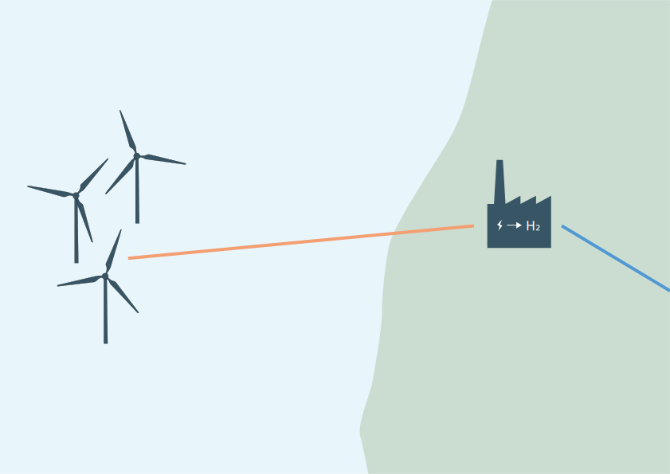
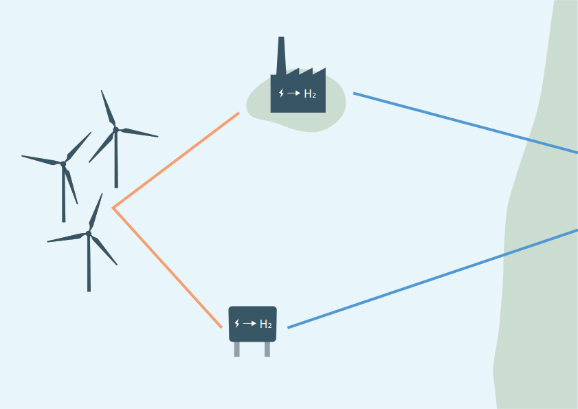
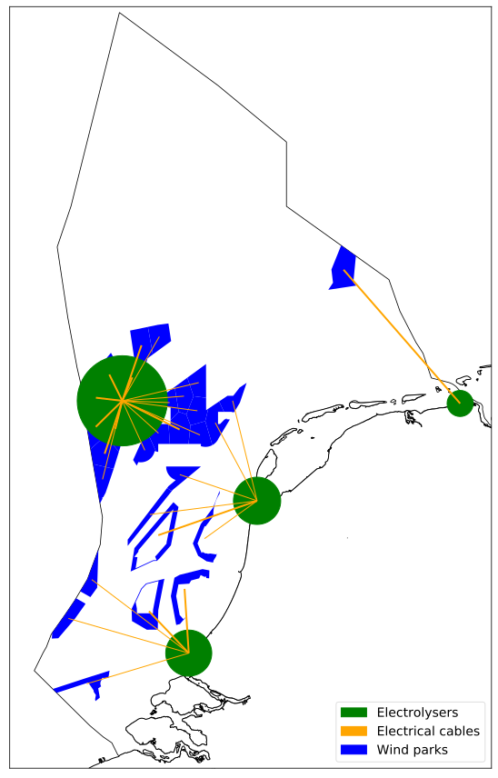
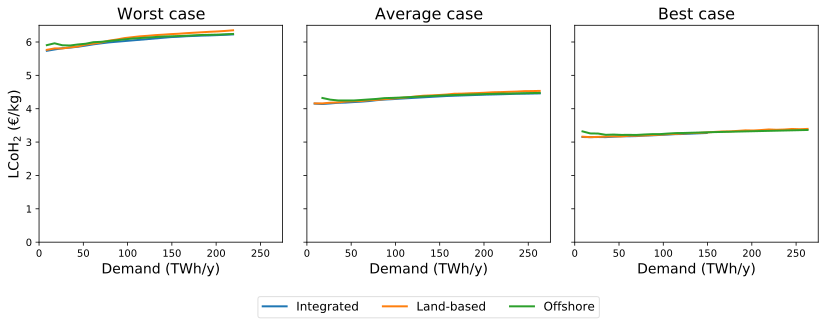
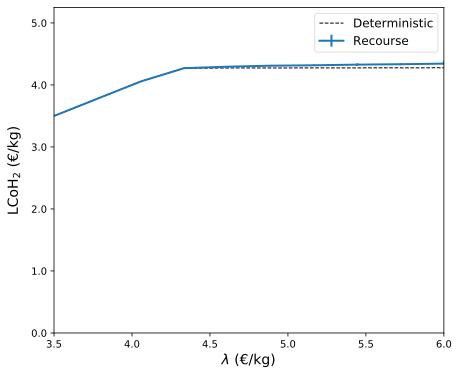
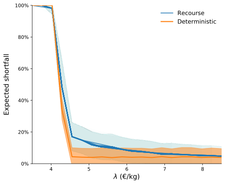
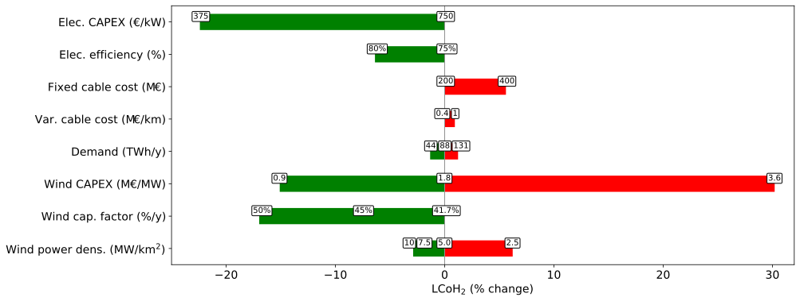

# Planning green hydrogen production

on the Dutch North Sea

 

Niels Wouda

26-02-2021

 

<small>(feel free to ask questions during the presentation)</small>

Note:

This presentation is about my master's thesis in OR. It won't be very long (I 
don't have a tonne to say), but I do want to share some of the highlights with you.

Note that I haven't given this presentation before, so I don't know how long it'll be.
Might be fifteen minutes, might be thirty - who knows!

Ask questions whenever you like - I don't mind.

---

# This presentation

- Problem setting

- Models

- Results

Note:

This presentation consists of roughly three parts.
 
I'll first discuss the problem setting of designing a hydrogen supply chain network
using offshore wind electricity as a feedstock. In this network we pay particular
attention to uncertainty in the wind electricity supply.

I then present the models in a very abstracted view. I won't go into too much math,
nor discuss the solution method, since that's not that interesting. But you do need to understand
at least the basics of these models to understand the results.

We then directly move to the modelling results, since that's the coolest bit of my thesis :). 

---

# Problem setting

- Hydrogen production from offshore wind electricity

- Electrolysis: $\ce{2H2O + electricity -> 2H2 + O2}$ 

- Wind intermittency (randomness)

----

## Research questions
  
- Where do we place electrolysers?
    - On land, or
    - Offshore, on artificial islands or re-used gas platforms?
- How do we obtain robust solutions w.r.t. uncertain wind electricity?
- Which parameters particularly influence hydrogen costs?

Note:

These three main questions I aim to answer in the coming few slides.

----

## Land-based electrolysers

<!---  --->

Note:

The first option is to build the electrolysers on land.
Offshore wind parks are connected to land-based electrolysers via electrical cables.
The hydrogen produced there is inserted directly into the onshore gas grid.

An obvious benefit of this setting is that electrolysers can be constructed, operated and maintained on land more easily, and require no expensive land reclamation projects or existing offshore infrastructure to function.

A downside is that longer, costlier electrical cables are required to connect offshore wind parks to the electrolyser plants on land.

----

## Offshore electrolysers

<!---  --->

Note:

The second option is to build both wind parks and electrolysers offshore.
Offshore wind parks are then connected with offshore electrolysers, again via electrical cables.
These offshore electrolysers are built on artificial islands, or on re-used gas platforms.
The hydrogen produced there is brought to shore via gas pipelines.

An advantage of this is that wind parks and electrolysers are built near each other, which reduces electrical cable lengths, and thus costs.
Additionally, offshore electrolysers allow the exploitation of areas far offshore which cannot easily be reached with cables from land.

Potential downsides of this setting are the cost of constructing artificial islands, and unclear cost and availability of re-using and converting offshore gas platforms for hydrogen production.

Of course, another final option is to allow both land- and sea-based electrolysers in an integrated scenario.
That we also consider.

We are now briefly going to discuss the model stuff, and then directly move to the results.

---

# Models

- Objective: minimise construction and operation costs of the hydrogen supply chain

- Constraints: production capacity should be sufficient to meet demand

- Decisions: where to construct wind parks, electrolysers, and electrical cables

Note:

Each model setting/formulation in my thesis basically wants to achieve this.
The constraints and precise objectives vary a little, but in the abstract this is
the structure of all of them.

----

## Robust solutions

What about uncertainty in production capacity?

- One way: relax demand constraint

  - Idea: price out production shortfalls (Lagrangian relaxation)
  
    _How do we tell the model about this?_
  
   _Solution:_ stochastic programming with many different wind scenarios

- Alternative: overcapacity in electricity production

  - Intuition: a little overcapacity might still produce sufficient electricity, even in 'bad' scenarios

  - Could result in expensive solutions, but is simple to solve

Note:

We haven't seen the uncertainty in wind electricity yet in the model formulations.
We consider that in two ways.

- First, we relax the hard demand constraint into a soft constraint (**draw on slide p>d, lambda, s = d - p**). That alone is not
  sufficient to get to a more robust formulation, since the standard model does not know about wind capacities: it sees only one
  realisation.
 
  We correct this by optimising over many different wind scenarios at the same time, via a stochastic programming (re)formulation.
  Drawing wind scenarios is challenging, and solving stochastic programming models isn't easy either - nor is it simple to explain.
  As such, we also consider an alternative.

- An alternative is conceptually quite simple: we could just build a large supply chain.
  If we increase the production capacity, eventually we obtain a network that produces sufficient hydrogen no matter the annual wind capacity factors.
  A downside is that this - of course - might be very expensive.

We'll see both options in the results section, next.

---

# Results

- LCoH$_2$: levelised cost of hydrogen (€/kg)

Note:

Rather than the objective values, we present costs as LCoH$_2$ to facilitate
comparison across demand levels.

Remember LCoH$_2$ as the production cost of a kilogram of hydrogen.
This is similar to how electricity is priced when constructing new power plants
or energy systems: as the levelised cost of electricity (LCoE).

----

## An example solution

<!--  -->

- No platforms are re-used!

- Preference for southern North Sea

Note:

Before we look at general figures, it might be helpful to get a feel of the scale
of these solutions, and what I propose in practice. This is an example solution
for about 2.5Mt of annual hydrogen production. That's roughly half of what the
chemical industry alone will need annually.

**Explain figure (draw)**

No platforms are re-used here.

Preference for the southern North Sea is easy to explain: it's much shallower.
This is a lot cheaper than constructing far offshore.

----

## Deterministic solution

<!---  --->

Compare:
 - Dutch electricity use is about 110TWh/y
 - Total Dutch energy use is about 650TWh/y

Note:

This is all still based on just the deterministic models, without any stochastic stuff.
We start simple.

In these three panels we show the hydrogen costs for different demand levels, wind capacity factors (worst = 30% annually,
average = 42%, and best = 55%), and the various model settings (electrolysers on land, offshore, or both).

Observations:

- Costs slope up a little with increasing demand. 
  This is largely due to needing more wind parks in deeper waters, which are more expensive to construct.
- Each model setting (land, offshore, integrated) obtains almost the same hydrogen costs.
  That suggest there is no economic reason to prefer land- or sea-based electrolysers.
  In this case, it is probably best to opt for electrolysers on land: they're easier to access, maintain, and do not need artificial islands or gas platforms.
- Almost none of the solutions use re-use gas platforms.
  This suggests their role in the future energy system might be limited.

We now turn to the stochastic model, and limiting shortfalls in production.

----

## Recourse solution

    
    

<!---  --->
<!---  --->

($\lambda$: LCoH$_2$ of a kg hydrogen shortfall)

Note:

$\lambda$ here is basically how we price out production shortfalls. 
So in these two figures we present the Lagrangian relaxation ('deterministic') and a number of replications of the stochastic model
('recourse').
The idea behind these replication is that, although we solve for a number of wind scenarios in a single model, we do not know whether
those scenarios accurately reflect the underlying distributions.
There is always a sampling error involved.
Repeating the solution process a number of times through replication, we obtain a much better sense of those sampling errors.

Observations:
- There is a regime switch from all shortfalls/no production for prices <4 to almost full production for prices >4.5.
  Compare that average production costs on previous slide.
- The deterministic model does not do much worse in terms of costs/imports compared to the recourse formulation.
  This suggests explicit modelling of wind uncertainties need not result in substantially better solutions.

  **But** before we conclude that, a _lot_ depends on dependencies in wind are modelled.
  And those are quite uncertain in my thesis, because the data is less than ideal.

This is the stochastic formulation. 
We next look at how we can obtain a robust solution by planting some overcapacity in wind electricity.
This might eliminate production shortfalls altogether. 

----

## Robustness

- Service level as a function of $\delta \ge 0$

- Robust solutions are rather cheap!

<!---  --->

($\delta$: percentage overcapacity in installed capacity in electricity generation)

Note:

We investigate overcapacity in electricity generation through a parameter $\delta$,
which states the percentage overcapacity relative to a demand level (the many different 
blue lines in the plot indicate different demand levels).

Observations:

- At $\delta=0$% (no overcapacity), the solutions generally have a 50/50 chance of producing
  sufficient hydrogen in a year.
- That scales _rapidly_ as we increase the overcapacity. At $\delta=10$% the
  empirical service level already reaches about 80%.
- At $\delta = 25$%, we find about $98-99%$%.

Also observe that the extra costs are not even that substantial: for +20% cost, we already obtain a very robust system.
Costs are +20%, rather than +25%, since we only need wind parks and electrical cables, but not also additional electrolysers.

Connecting this excess electricity generation capacity to electrolysers is easier if these electrolysers are constructed in central places.
That suggests, again, that land-based electrolysers are the way to go, at least initially.

Having discussed stochasticity and robust solutions,
we now turn to a sensitivity analysis investigating the effects of our parameter
choices on the modelling result.

----

## Sensitivity analysis

<!---  --->

Particularly important:

- Wind and electrolyser construction costs (CAPEX)

- Electrolyser efficiency

- Average wind capacity factor

Note:

Here we vary individual parameters w.r.t. their baseline parameter levels.

Observations: (**in presentation)**
- Explain baselines
- Discuss the important parameters (see slide).

There's also a two-way sensitivity plot (where we study the interaction of
two parameter level changes at the same time), but that is nearly impossible to
read from a slide. So for that thing you'll have to read my thesis :).

In terms of content, this is the end of the presentation and I'll now wrap up.

---

# Conclusion

- Construct electrolysers on land, or on artificial islands
- Existing gas platforms have no place in the green hydrogen production chain
- At scale robust solutions are cheap (+20% cost for a service level around 98-99%)
- Green hydrogen can be produced today at costs around €4-4.5/kg
- Costs are sensitive to
  - Capital costs
  - Electrolyser efficiencies
  - Wind capacity factors
  
  (these are all steadily improving!)

Note:

And future research. In particular: 

- How much storage is needed? Is that worthwhile compared to overcapacity?

- Better wind capacity factor modelling. This is rather difficult due to limited
  (public) data availability for offshore wind.
  
- What about _time_, rather than _space_? Hydrogen deployment pathways?

---

# Questions?

Note:

Thank everyone for their time.
