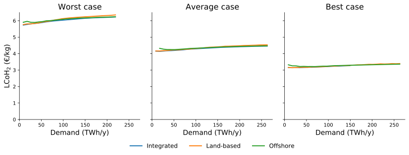

# Planning green hydrogen production

on the Dutch North Sea

 

Niels Wouda

26-02-2021

 

<small>(feel free to ask questions during the presentation)</small>

---

# This presentation

- Problem setting

- Results

- Conclusion

Note:

TODO

---

# Problem setting

----

## Setting

- Hydrogen production from offshore wind electricity

- Electrolysis: $\ce{2H2O + electricity -> 2H2 + O2}$ 

- Wind intermittency (randomness)

Note:

TODO

----

## Research questions
  
- Where do we place electrolysers?
    - On land, or
    - Offshore, on artificial islands or re-used gas platforms?
- How do we obtain robust solutions?
- Which parameters particularly influence production costs?

Note:

TODO

Robust wrt wind randomness

----

## Land-based electrolysers

<!---  --->

Note:

TODO

----

## Offshore electrolysers

<!---  --->

Note:

TODO

---

# Results

- LCoH$_2$: levelised cost of hydrogen (€/kg)

Note:

Rather than the objective values, we present costs as LCoH$_2$ to facilitate
comparison across demand levels.

Remember LCoH$_2$ as the _production cost_ of a kilogram of hydrogen.
This is similar to how electricity is priced when constructing new power plants
or energy systems: as the levelised cost of electricity (LCoE).

----

## Deterministic solution

<!---  --->

Compare:
 - Dutch electricity use is about 110TWh/y
 - Total Dutch energy use is about 650TWh/y

Note:

TODO

----

## Recourse solution

    
    

<!---  --->
<!---  --->

($\lambda$: LCoH$_2$ of stored/imported hydrogen)

Note:

TODO _maybe_ slide on recourse?

----

## Robustness

- Service level as a function of $\delta \ge 0$

- Robust solutions are rather cheap!

<!---  --->

($\delta$: percentage overcapacity in electricity generation relative to a demand target $d \ge 0$)

Note:

This is usually achieved via a (joint) chance constraint in the model formulation.
That did not solve, so instead we built a little overcapacity using the regular,
deterministic formulation. That is very effective in practice.

Given a demand target $d$, we plant $(1 + \delta) d$ instead, for some overcapacity
parameter $\delta \ge 0$.

(this figure based on 10GW/88TWh annually)

Observations:

- At $\delta=0$% (no overcapacity), the solutions generally have a 50/50 chance of producing
  sufficient hydrogen in a year.
- That scales _rapidly_ as we increase the overcapacity. At $\delta=5$% the
  empirical service level already reaches 98.2% (based on 10,000 samples).

----

## Sensitivity analysis

<!---  --->

Particularly important:

- Wind and electrolyser construction costs (CAPEX)

- Electrolyser efficiency

- Average wind capacity factor

Note:

Here we vary individual parameters w.r.t. their baseline parameter levels.

TODO

There's also a two-way sensitivity plot (where we study the interaction of
two parameter level changes at the same time), but that is nearly impossible to
read from a slide. So for that thing you'll have to read my thesis :).

---

# Conclusion

- Construct electrolysers on land, or on artificial islands
- Existing gas platforms have no (serious) place in the green hydrogen production chain
- At the national scale, robustness is cheap (+5% cost on average, for a service level around 98-99%)
- Green hydrogen can be produced today at costs around €4-4.5/kg
- Costs are sensitive to
  - Capital costs
  - Electrolyser efficiencies
  - Wind capacity factors
  
  But these are all steadily improving!

Note:

And future research. In particular: 

- How much storage is needed? Is that worthwhile compared to overcapacity?

- Better wind capacity factor modelling. This is rather difficult due to limited
  (public) data availability for offshore wind.
  
- What about _time_, rather than _space_? Hydrogen deployment pathways?

---

# Questions?
