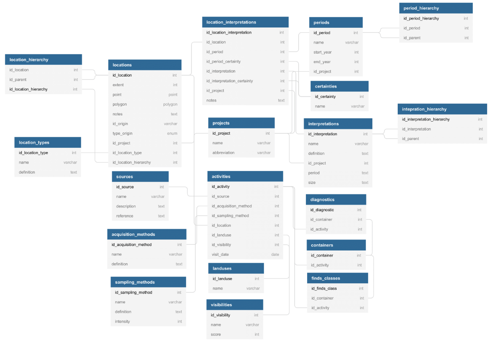

# RHP Technical meeting

 

Niels Wouda

04-01-2021

 

<small>Speaker notes can be accessed via the `s` button</small>

Note:

This window contains the speaker notes, per slide (some slides do not have notes).
Keep the window open to read along!

---

# This meeting

We are going to discuss:

- The database (RHPdb)

- How we got there

- Extending the database

---

# The database

- Tech: PostgreSQL, with PostGIS extension for geodata
- Contains (most of) the TVP, Suburbium, and PRP data
- New projects should not require changes to the database structure

Note:

The tech stack is a simple SQL database, not unlike Access. PostGIS adds support
for querying and storing geodata. That can be used directly (not recommended),
or through another tool like gis.

Most data have been mapped over, in particular location data, site
interpretations, and many diagnostics and other finds. Activities and survey
methodologies/conditions have not been mapped over in this pilot.

The database _structure_ does not directly depend on project-specific ideas, so
new projects can be inserted without having to change existing structures/data.
Of course, the mapping process is still very laborious. 

----

## Schema

This is the lay-out of the RHP database.

Note:

We will discuss this in detail in the next few slides, zooming in on each part
of the database.

----

## Locations

TODO

----

## Finds

TODO

----

## Activities

(not in the prototype)

Note:

As already alluded to, this part of the database is only partially implemented.
Parts of it exist, parts do not - it is not really ready for querying, and still
needs quite a bit of work.

That work will not be done for the prototype.

----

## An aside: migrations

TODO

---

# How we got here

----

## A bit of process

- Pumping data from the project-specific databases to the RHPdb requires 
_mappings_ (data), which are used by _mappers_ (code). Making mappings requires 
quite a bit of discussion.
  - We found early on that it is best to start from a concrete proposal prepared 
    by one person, which is then reviewed by all. This results in focused 
    discussion, and quicker agreement.

- GitHub works really well for us:

  - Has an issue tracker where discussion can take place.
  
  - Stores everything so no history is hidden in (individual) mailboxes.
  
  - Has a wiki system we use for manuals and documentation.

  - Uses _git_ to store the code/mappers, so everything's in one place!

Note:

These mappings and mappers will be discussed shortly. Make sure you understand
the difference between a _mapping_ (data) and a _mapper_ (code). The first is
purely a table, the latter is a thing that does something.

Concrete proposals are possible because we already understand each others data
somewhat. Most of it is fairly similar, so it is not too hard to draw up a first
mapping. This first proposal immediately highlights things that are not yet 
sufficiently clear, and need project-specific input. That's then incorporated 
via an iterative process, until everyone agrees.

GitHub also hosts all the code.

---

# Mappings

> A _mapping_ is a function that takes a **project-specific input** and transforms
> it into a **standardised output**, ready for ingestion into the RHPdb. 

You write these mappings!

Note:

I'm pointing this out explicitly because I want to hammer down that we are taking
_inputs_ from the project databases, map them in some fashion, and write the 
_output_ into the RHPdb. This is crucial to understand the code base.

These mappings are written to cover all cases found in the input data. How to cover
these takes an archaeologist - I'm here to point out cases that have been missed,
and implement them once the mapping is completed.

----

## Mapping when original records are kept

- Mappings are used:
  - To translate non-English terminology
  - To fix common spelling errors

- These standardised values are then referenced in the RHP site interpretation and
  periodisation hierarchies.
- New records are also created, belonging to the RHP project. 

(This is how we mapped over the site interpretations)

Note:

This is not a 'true' mapping, in the sense that we do not really dispense with
the old. Nonetheless, half the database consists of these types of records, and
it is important to understand there are two types of mappings in play.

Because we keep the original data insofar possible and also have the new RHP
records, queries require some nuance to avoid duplicate counting. We will discuss
that in the user meeting.

----

## Mapping when original records are not kept

- Mappings are used:
  - To create _concordance lists_, placing old values next to the new one.
  - As a true function, taking the old value and mapping it to the new one.

(We did this with finds artefacts, and in general with all well-understood typologies)

Note:

This is conceptually the easiest type of mapping, because no old values are kept
at all. Instead, we introduce our own terms for everything and match each 
project-specific terminology to our terms.
 
This is **much preferred** over keeping the original records, but cannot always
be done.

----

## Some examples

----

## Site interpretations

TODO

----

## Black glazed typology

TODO

---

# From data to code

So now we have some mappings in Excel files.. what's next?

----

## Code

TODO

---

# Extending the database

TODO
