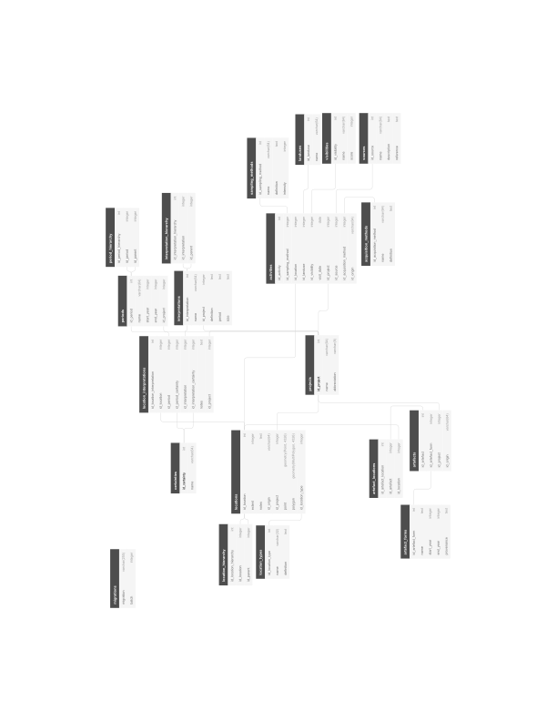

# RHP Technical meeting

<br>

Niels Wouda

04-01-2021

<br>

<small>Speaker notes can be accessed via the `s` key</small>

Note:

This window contains the speaker notes, per slide (some slides do not have notes).
Keep it open to read along!

This presentation serves as a complete - albeit high-level - introduction to the
construction of the RHP database. As such, it has two audiences: _archaeologists_
(you) and a future _developer_. I attempt to document both roles in this process.
Most of the presentation is kept rather simple, but some jargon is inevitable.  

---

# This meeting

- The RHP database (RHPdb)

- How we got there

- Extending the database

---

# The database

- PostgreSQL, with PostGIS extension for geodata
- Contains (most of) the TVP, Suburbium, and PRP data
- New projects should not require changes to the database structure

Note:

The tech stack is a simple SQL database. We use Postgres, which is similar to 
Access (but does not come bundled with a viewer/visual query builder). PostGIS
adds support for querying and storing geodata. That can be used directly, or 
through some other tool (GIS/Python). The mapping process and database 
versioning are done with Python (more in a few slides).

Most data have been mapped over, in particular location data, site
interpretations, and many diagnostics and other finds. Activities and survey
methodologies/conditions have not been mapped over in this pilot.

The database _structure_ does not directly depend on project-specific ideas, so
new projects can be inserted without having to change existing structures/data.
Of course, the mapping process is still very laborious. 

----

## Schema



<!--- This is a huge hack but ensures reveal-md actually copies the svg file -->
<!---  --->

Note:

We will discuss this in detail in the next few slides, zooming in on each part
of the database.

We are not going to discuss *content* in detail (that's for the user meeting).
Rather, we will walk through the structure of the RHPdb, including some example
records, to get a feel for what's stored where.

----

## Projects

- Referenced (almost) everywhere.
- Documents the specific project a record came from.
- Currently contains:

| id_project | name | abbreviation |
|---|-------------------------|-----|
| 1 | Rome Hinterland Project | rhp |
| 2 | Pontine Region Project  | prp |
| 3 | Rome Suburbium Project  | rsp |
| 4 | Tiber Valley Project    | tvp |

Note:

# Why is the RHP in here?

The RHP introduces some (location) interpretations and periodisations that are
not related to the original projects, so we needed a way to track those. Making 
the RHP into a project was the easiest way to achieve this.

Plus: the RHP is not special. Our new typologies and interpretations and the like
are not that different from the project-specific efforts. 

----

## Locations

- Various types of locations (`location_types` table). 
  - Currently: `site`, `subsite`, and `unit`.
- Locations are hierarchical (`location_hierarchy` table).
  - Subsites have a site parent.
  - (Some) units have a site parent.
- Sites and subsites often have an interpretative aspect, units do not.
  - Interpretation is stored in the `location_interpretations` table, as one 
    record per (interpretation, period)-pair.
- Geodata (`point` and/or `polygon` fields).
- Examples (shortened, one from each project):

| id_location | id_origin | id_project | point | polygon | id_location_type |
| --- | --- | --- | --- | --- | --- |
| 1 | HL09_12947 | 2 | `<binary>` | | 1 |
| 12615 | I12-22 | 3 | `<binary>` | `<binary>` | 2 |
| 16794 | 12540 | 4 | `<binary>` | | 1 |

Note:

Many examples of hierarchical locations from each project. E.g.:
- TVP has the Veii site, and various sites within it. Veii is a site in the RHP,
  the sites (TVP) within it are subsites (RHP). We use the hierarchy to link them.
- The subsite terminology is inspired by the Suburbium project, where it is
  ubiquitous. Subsites are linked to sites via the hierarchy.
- The PRP has units and sites, where sites might span many units - that's again
  linked via the hierarchy.

The example records excludes the `extent`, `notes`, and `rhp_notes` fields 
because that would not fit, and they are empty for these records. In `notes` we
place existing notes. In `rhp_notes` we sometimes add a new note explaining some
mapping detail.

Notice the `id_origin` field. Your original data is never far away!

----

## Location interpretations

- Like TVP's `tvp_interpretation` and PRP's `prp_source_site_interpretation`.
- Flexible.
- Certainties for the assigned period and interpretation.
  - Currently one of `certain`, `probable`, and `uncertain`.
- Example (shortened):

| id_location_interpretation | id_location | id_period | id_period_certainty | id_project |
| --- | --- | --- |  --- | --- |
| 1 | 825 | 14 | 2 | 2 |

Note:

Interpretations are done per period, where a period is historical. This is 
different than e.g. the Suburbium data, so we did some mapping there.

Corresponding tables are:
- `prp_source_site_interpretation` (PRP)
- `tvp_interpretation` (TVP)
- `chronology` (RSP)

The example record excludes the `notes`, `id_interpretation`, and 
`id_interpretation_certainty` fields, because otherwise the table would not fit.
Their meaning is hopefully straightforward.

----

## Interpretations

- List of interpretations, per project. Examples (shortened):
| id_interpretation | name | id_project | definition |
| --- | --- | --- | --- |
| 6 | Infrastructure | 1 | `<text>` |
| 22 | Travel and transport | 1 | `<text>` | 

- Linked into a hierarchy via `interpretation_hierarchy` table:
| id_interpretation_hierarchy | id_interpretation | id_parent |
| --- | --- | --- |
| 14 | 22 | 6 |
| 26 | 33 | 22 |

Note:

Each interpretation has a name, a project origin (the examples are all new RHP
types), and optional definitions, and period and size specifications (free-form
text). 

The hierarchy relates to Travel and Transport (first record it is a child under
Infrastructure, in the second row it is the parent to some other interpretation
with ID 33).

----

## Periods

- List of periods, per project. Examples (shortened):
| id_period | name | start_year | end_year | id_project |
| --- | --- | --- | --- | --- |
| 8 | Iron Age | -1000 | -581 | 2 |
| 140 | Iron Age | -1000 | -721 | 4 |

- Linked into a hierarchy via `period_hierarchy` table (similar to previous
  slide).

Note:

This is all very similar to the interpretations of the previous slide. Notice 
that different projects have different year ranges for similar periods.

----

## Finds

- Diagnostics and non-diagnostics are both in the `artefacts` table.
  Examples (shortened):
| id_artefact | id_artefact_type | id_project |  number |  id_ware | is_diagnostic | weight |
| --- | --- | --- | --- | --- | --- | --- |
| 1 | 536 | 2 | 1 | 3 | true | |
| 24167 | 42 | 3 | 1 | 3 | true | |
| 35559 | | 4 | 1 | 1 | true | 9 |

- (Ceramic) typologies in the `artefact_types` table.

- Wares in the `wares` table.

Note:

For the examples I did not display the `id_origin` (sherd ID in project databases)
and `rhp_notes` (RHP implementation details, where applicable) columns.

----

## Artefact types

- Typologies, currently only for ceramics

- Example records:
| id_artefact_type | name | start_year | end_year |
| --- | --- | --- | --- |
| 15 | Hayes 181 | 100 | 300 | 
| 393 | Dressel 1 | -130 | -10 |

- There is also a `provenance` column which is currently free-form text, and
  awaits standardisation.
  
Note:

Provenances are being standardised, but it is not completely implemented yet. 

----

## Wares

- Ceramic wares

- Example records:
| id_ware | name | id_parent |
| --- | --- | --- |
| 2 | Fine ware | |
| 3 | Coarse ware | |
| 23 | Eastern sigillata | 2 |
| 24 | African red slip ware | 2 |
| 25 | Impasto chiaro sabbioso | 3 |
| 26 | Pompeian red ware | 3 |

Note:

The `id_parent` column references back into the `wares` table. So `Eastern
sigillata` is a `Fine ware` (under `2`), and `Pompeian red ware` is a `Coarse
ware` (under `3`).

----

## Shapes and functions

TODO

----

## Provenances

TODO

----

## Activities

(not fully implemented)

Note:

As already alluded to, this part of the database is only partially implemented.
Parts of it exist, parts do not - it is not really ready for querying, and still
needs quite a bit of work.

That work will not be done for the prototype.

----

## Things not (yet) mapped

- Coarse ware typology

- Methodology: sampling method, land use, sources (all part of activities)

- (various details of) non-ceramics

- ceramics: fragment types, fabrics, decorations (?)

Note:

This somewhat complements the discussion about the database schema, since in 
part the schema will need to be updated to accommodate these. Here I want to
present a list of content that we have not (yet) standardised, and is as such
not in the RHPdb. 

---

# How we got here

- Pumping data from the project-specific databases to the RHPdb requires 
_mappings_ (data), which are used by _mappers_ (code). Making mappings requires 
quite a bit of discussion.
  - We found early on that it is best to start from a concrete proposal prepared 
    by one person, which is then reviewed by all. This results in focused 
    discussion, and quicker agreement.

- GitHub works really well for us:

  - Has an issue tracker where discussion can take place.
  
  - Stores everything so no history is hidden in (individual) mailboxes.
  
  - Has a wiki system we use for manuals and documentation.

  - Uses _git_ to store the code/mappers, so everything's in one place!

Note:

How is the database schema then populated? How did we agree on what things mean,
so that we could place them in an _integrated_ database?

That's what this section is about.

The mappings and mappers will be discussed shortly. Make sure you understand
the difference between a _mapping_ (data) and a _mapper_ (code). The first is
purely a table, the latter is a thing that does something.

Concrete proposals are possible because we already understand each others data
somewhat. Most of it is fairly similar, so it is not too hard to draw up a first
mapping. This first proposal immediately highlights things that are not yet 
sufficiently clear, and need project-specific input. That's then incorporated 
via an iterative process, until everyone agrees.

Compare that to [this timeless wisdom](https://tom.preston-werner.com/2010/08/23/readme-driven-development.html):

>It’s a lot simpler to have a discussion based on something written down. It’s 
>easy to talk endlessly and in circles about a problem if nothing is ever put to
>text. The simple act of writing down a proposed solution means everyone has a
>concrete idea that can be argued about and iterated upon.

---

# Mappings

> A _mapping_  takes a **project-specific input** and transforms it into a
> **standardised output**, ready for ingestion into the RHPdb. 

- A mapping is often formulated as a table, with at least an _in_ and _out_ 
  column (and possibly others).

- The process for writing these is often something like this:
  1. I post a list of all values found in the project-specific databases for some
     entity (e.g., all black glazed types used by each project) in the appropriate
     GitHub issue. These form the _in_ (input) column.
  2. You (an archaeologist) determine an appropriate RHP typology, and map the _in_
     values to a new _out_ value taken from that typology. This is the _out_ column.
  3. Once completed, I take the mapping and restructure it a little so the code can
     ingest it. The code first writes the RHP typology to the database, and then 
     uses the mapping to integrate the project-specific data.

Note:

I'm pointing this out explicitly because I want to hammer down that we are taking
_inputs_ from the project databases, map them in some fashion, and write the 
_output_ into the RHPdb. This is crucial to understand the code base.

The difference between a mapping and a new typology is also important. The new
types are defined first, and then a mapping is written. We focus on the mapping
here, not the new types (that's for the user session).

----

## Mapping types

- In some cases we impose RHP type hierarchies ('classes' and 'super classes') on
  top of project-specific data, but also keep the original typology.

- In other cases we fully integrate the project-specific data using new RHP
typologies. Original typologies are not kept.

Note:

Let's first have a look at two examples!

----

## Sites

- RHPdb has a unified hierarchy _on top of_ project-specific interpretations.

- Project-specific interpretations are thus also in the RHPdb.

- Example (TVP site interpretations):

| in                                         | out            | rhp           |
|--------------------------------------------|----------------|---------------|
| Funerary:   catacomb                       | Catacomb       | Catacomb      |
| Funerary:   cemetery / necropolis          | Necropolis     | Burial ground |
| Funerary:   columbarium                    | Columbarium    | Columbarium   |
| Funerary:   mausoleum                      | Mausoleum      | Mausoleum     |
| Funerary:   tomb - tumulus                 | Tomb - tumulus | Tomb          |
| ... | ... | ... |

Note:

Here we see that the functional classification of the TPV types ('Funerary:')
is subsumed by the hierarchical structure of the RHP's site types. Indeed,
these types are all under the 'Funeral' parent.

Besides the newly named, project-specific types in the _out_ column, we also
add records with this interpretation as an RHP record with the type indicated
by the _rhp_ column. That leads to a bit of 'duplication' (depending on your 
perspective), but much more effective querying.

Out names are always similar to the _in_ name - _rhp_ names not necessarily!

We only add something on top of project-specific data. This means you can query
both by the project-specific interpretations of the _out_ column (if you know
them), or use our hierarchy to get the right results.

This example only discusses the interpretations, but the same holds for
periodisations.

----

## Black glazed artefacts

- RHPdb has its own typology.

- Project-specific artefacts with project-specific types are mapped over using
  appropriate RHPdb types. Original types are not kept.

- Example (PRP black glazed typology):

| in                     | out           |
|------------------------|---------------|
| Morel form 1110-20     | Morel 1110-20 |
| Morel form 1111        | Morel 1111    |
| Morel form 1113(b1)    | Morel 1113    |
| Morel form 1440 series | Morel 1440    |
| Morel form 1443(l1)    | Morel 1443    |
| ... | ... |

Note:

This means the project-specific interpretations are **not** available in the 
RHPdb.

These sorts of mappings (where the old types are not kept) are very simple, and
always have at least an _in_ and _out_ column.

----

## Mapping when original types are kept

- Mapping is used to:
  - Translate non-English terminology,
  - Fix common spelling errors,
  - Insert important meta-data (_e.g._ definitions) not found in the 
    project-specific database.
- These mapped (project-specific) values are then placed into a RHP type hierarchy.
- New records are also inserted, using RHP typologies.

(We used this for site types and periods)

Note:

This is not a 'true' mapping, in the sense that we do not really dispense with
the old. Nonetheless, half the database consists of these types of records, and
it is important to understand there are two types of mappings in play.

We will see an example of this shortly. 

Because we keep the original data insofar possible and also have the new RHP
records, queries require some nuance to avoid duplicate counting. We will discuss
that in the user meeting.

----

## Mapping when original types are not kept

- This is far simpler.

- Mapping takes a project-specific value and transforms it to the appropriate RHP term.

- Controlled vocabulary.

(We did this with finds artefacts, and in general with all well-understood typologies)

Note:

This is conceptually the easiest type of mapping, because no old values are kept
at all. Instead, we introduce our own terms for everything and match each 
project-specific terminology to our terms.

We map to our new RHP types, so these mappings are very simple. All meta-data
is with the new type lists, and not present in the project-specific mappings.

This is **much preferred** over keeping the original records, but cannot always
be done.

---

# Populating the database

So now we have some mappings in (Excel) data files.. what's next?

Note:

This is to a large extent why this is the _technical_ meeting. 

----

## Mappers

- Implemented in Python.

- Each project has its own mappers.

- Each mapper is responsible for populating one table of the RHP database.

- The RHPdb is completely reversible: adding and removing project data is fully
  supported. That is useful when developing adding new projects/data.

Note:

The reason each project has its own mappers is that there is quite a bit of
customer work needed to map all data over. Some projects store things _very_
differently from how we designed the RHPdb, which means we need to write some
code handling that diversity.
 
This means new code will likely be necessary for future projects. A lot of
existing work can likely be re-used in that case as well: this is already the
case with the existing three projects as well.

The RHPdb is the end result of these mappers. As such I never modify anything in
the RHPdb itself: if something needs to be changed, a mapping or mapper should
be updated instead. Sometimes the project databases are the ones that need to be
updated (when we discover a mistake there). Never the RHPdb.

----

## Developing mappers

- Using and developing the RHP tool are explained in the wiki on GitHub:
 - [Here](https://github.com/N-Wouda/RHP/wiki/How-to-develop) for setting everything up on your computer and understanding the structure of a Mapper.
 - [Here](https://github.com/N-Wouda/RHP/wiki/How-to-use-the-RHP-tool) for running the RHP tool from the command line.
- Mappers have the following (simplified) structure:

```python
class Mapper:
    from_tables: List[str]
    to_table: str
    field_mapping: Dict[str, str]

    def up(self):  # execute
        data = self._read()
        data = self._map(data)
        self._write(data)

    def down(self):  # rollback
        self.write_connection().table(self.to_table).delete()
```

Note:

A mapper has two tasks, depending on what you want to do:
- Insert its data into the appropriate RHP table
- Remove that data

These two tasks are implemented in the `up` (insert) and `down` (remove)
methods. Both have defaults that are somewhat simplified here. `down` is less
important: I have never had to implement it differently. `up` is less clear cut,
and we will discuss that next.

`up` has three steps: first, `_read` the data from project-specific table(s),
then `_map` (transform) that data into something the RHPdb understands, and 
finally `_write` that transformed data to the RHPdb table. Each of these methods
have defaults, but those are not always sufficient: in particular `_map` is
often overwritten.

Observe that the Mapper class has some member data: `from_tables`, a list of
table names in the project database that must be mapped, `to_table`, the name of
the RHPdb table, and `field_mapping`, which is a (loose) mapping of
project-specific column names to RHPdb column names.

The full `Mapper` class has a few other methods that help implementing mappers,
but are not as important to discuss here explicitly. 

----

## A mapper example

- Now that we have a basic understanding of the mapper structure, we can look
  at a simple example.

Note:

I'm going to show some examples in the code base, which is also on GitHub.
The following are good candidates:

- PRP: LocationMapper, LocationHierarchyMapper, ArtefactMapper
- RSP: SubsiteInterpretationMapper
- TVP: LocationMapper

---

# Extending the database

----

## Updating the schema

- Python and the [orator](https://orator-orm.com/) package.

- You already know the concept of a _schema_. Here we introduce a
  _schema builder_.

- The schema is built incrementally via _migrations_.

Note:

This hopefully answers TdH's question how to edit/add to the database structure.

I use Python and the [orator](https://orator-orm.com/) package for this. From 
Orator, in particular its [migrations](https://orator-orm.com/docs/0.9/migrations.html) 
and [schema builder](https://orator-orm.com/docs/0.9/schema_builder.html) functionality
is used.

For migrations: remember that strange `migrations` table in the schema? It's
tied to this!

----

## Migrations

- Suppose we want to add the `actors` table to the RHPdb. The table includes at
least a unique ID `id_actor` and an actor `name`. 

- This is how such a `CreateActors` migration is written using `orator`:

```python
from orator.migrations import Migration


class CreateActors(Migration):

    def up(self):
        with self.schema.create('actors') as table:
            table.increments('id_actor')
            table.string('name', 128)

    def down(self):
        self.schema.drop_if_exists('actors')
```

- Many other examples in the `migrations` directory of the RHP codebase 
([on GitHub](https://github.com/N-Wouda/RHP/tree/master/migrations)). There is
a README there as well. Together, these migrations incrementally construct the
database schema.

Note:

# What's happening here? 

A `Migration` has two methods, `up` and `down`. We will also see this for the
database mappers, later on. `up()` applies these changes to the database, 
`down()` removes the changes - if they exist. The current state of the database
is tracked in the `migrations` table in the RHPdb.

That defines the structure of a migration. Now the contents of these methods.

Each method uses Orator's _schema builder_ to update the schema. 

In the `up()` method, the 'actors' table is created. We also specify the columns
we want on that table, in this case a unique, incrementing ID called 'id_actor',
and a fixed-size character field called 'name'.

The `down()` method drops the 'actors' table from the database, if the table
exists (and does nothing otherwise). This is useful when implementing the mappers
in code, as that often takes many tries. The RHPdb is built using a completely
reversible process - clearing the database and re-inserting the data can be done
in less than a minute.

# What if you want to add more attributes later?
 
Simple, write another migration! See the files in the `migrations` directory on
GitHub. The whole process on how to run these migrations (with orator) is also
explained there.

----

## Populating the new table

- After adding a new column or table to the schema, the usual process of writing
  mappings and  mappers applies:
  - Determine how to map over data, and, if appropriate, formulate a mapping.
  - Implement a new `Mapper` in the project directory (and add it to the `MAPPER` list),
    or update the appropriate existing mapper.
  - Import your changes into the database. This will probably require a few 
    iterations to get your changes exactly right.

- This is precisely what we explained when we discussed the `Mapper` class!

Note:

Of course this is non-trivial. But the point is that there are a lot of examples
(the entire codebase), and adding new data should not be approached any differently.

---

# Questions?

---

# That's all, folks!

- These slides are all online, so you can (re-)read them later.
 
- To facilitate re-use, there are a lot of speaker notes in the presentation.

- Anything unclear? Mail me at [nielswouda@gmail.com](mailto:nielswouda@gmail.com), 
  or contact me through the GitHub repository. 
