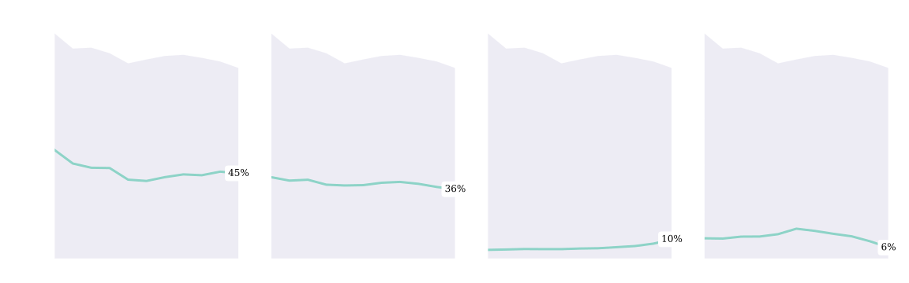
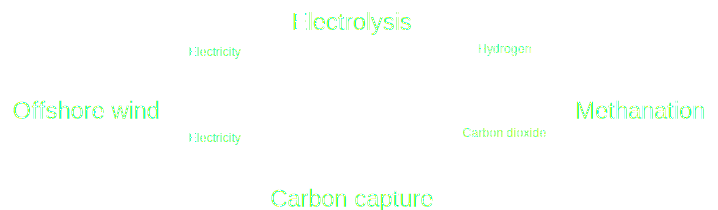

# Syngas - an opportunity to reduce carbon emissions

 

Niels A. Wouda

01-12-2021

---

## Motivation

- In NL, about 45% of total energy production is based on natural gas [3]
- Pollutes carbon dioxide

----

## Motivation

- Syngas has 'simple' chemistry:
    - **Electrolysis**: water + electricity $\longrightarrow$ hydrogen
    - **Carbon capture**: exhaust fumes + electricity $\longrightarrow$ carbon dioxide
    - **Methanation**: hydrogen + carbon dioxide $\longrightarrow$ syngas
- Syngas is **carbon-neutral** when renewable electricity is used

----

## Motivation

- Methanation and carbon capture are very expensive
- But so were (offshore) wind and solar just a decade ago: [1]

    (Electrolysis cost has gone down by ~40% in past five years [2])

----

## Motivation

- Syngas today is more expensive than natural gas
  - But how much more expensive?
  - What drives costs?
- What carbon tax would make syngas production cost-competitive?

---

## Solution approach

- Designing a syngas production network at minimal cost:
  - gives estimate of syngas production cost;
  - yields relative costs of all parts of the network;
  - can be used to determine a cost-competitive carbon tax.
- Has many **policy implications**!

 

So, what I work on is:
> How to construct a minimum-cost network for syngas production using captured carbon dioxide and renewable electricity?

---

## Conclusion

- Syngas is great in theory, expensive in practice
- I want to find out what drives the cost of syngas production
- What is needed to make syngas cost-competitive?

---

## References

1. Adapted from Figure ES.3 of 
   IRENA (2021), 
   _Renewable Power Generation Costs in 2020_, 
   International Renewable Energy Agency.
   https://irena.org/publications/2021/Jun/Renewable-Power-Costs-in-2020

2. G. Glenk and S. Reichelstein (2019), 
   Economics of converting renewable power to hydrogen,
   _Nature Energy_ 4, 216–222. https://doi.org/10.1038/s41560-019-0326-1

3. CBS (2021), _Energiebalans; aanbod, omzetting en verbruik_, 
   https://www.cbs.nl/nl-nl/cijfers/detail/83140NED.
