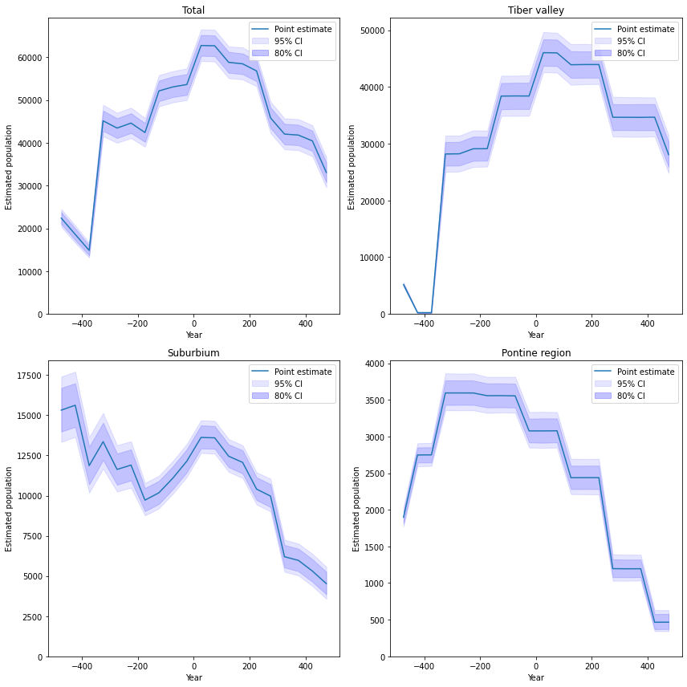

# Test slides

<br>

Niels Wouda

28-11-2020

---

# First section

Some styling:

`inline code`

_emphasis_

**strong**

~~crossed out~~

<ins>underlined</ins> ([with an HTML tag](https://stackoverflow.com/a/47354053/4316405)).

----

## Some lists
 
- Bullet 1
- Bullet 2

and

1. Item 1
2. Item 2

----

## Code

(from the RHP code)

```python
from orator.migrations import Migration


class CreateTypeColumnArtefactForms(Migration):
    """
    Artefact migration.    
    """
    
    def up(self):
        pass

    def down(self):
        pass
```

---

# A new section

----

# Some math

With some inline $\LaTeX$, like $x = 3$, or display math, like

$$f(y) = \int_0^\infty y dy$$

or

$$\sum_{k = 1}^n k = \frac{n(n + 1)}{2} $$
----

# An image

(from the EAA RHP presentation)



----

# A table

| Header 1 | Header 2 |
| --- | --- |
| Value 1 | Value 2 |
| Value 3 | Value 4 |

---

# The end
